MegaGem is a multiplayer, imperfect-information auction game developed by Jane Street. In our 3-player, general-sum experiments, self-play opponents and relative outcome rewards produce no measured transferable improvement. Some policies learn opponent-specific exploits, while the runs against SFT checkpoints stay flat. The rollout infrastructure proves more useful as a data engine: policy-generated bid logs support a conditional market model. Starting from Qwen3-4B-Instruct, we train with SFT, build a paced distributional bidder, and distill its decisions through expert iteration. The final specialist wins direct paired comparisons against almost all benchmark opponents including Opus 4.8, GPT 5.5, and others while remaining statistically unresolved against Gemini 3.1 Pro.

This blog would not be possible without the ongoing support of many people. I'm especially grateful to [Johannes Hagemann](https://x.com/johannes_hage?lang=en), [Sebastian Müller](https://x.com/omouamoua), [Christian Reetz](https://x.com/creet_z), and [Peyton Walters](https://x.com/peywalt) for their generous provisioning of credits for compute and access to model APIs.

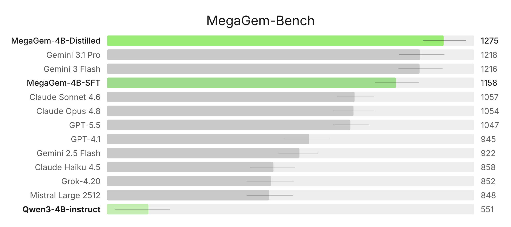

*Reading note:* To keep the main argument moving, several derivations, diagnostics, and examples are collapsed by default. Feel free to read linearly or ignore collapsed sections :).

## table of contents

- [understanding MegaGem](#understanding-megagem)
  - [Full rules](#full-rules)
- [examples](#examples)
  - [Decision 4: a reveal moves the market, not the terminal supply](#decision-4)
  - [Decision 5: a loan is worth its liquidity, not its face value](#decision-5)
  - [Decision 6: late-game bidding becomes auction poker](#decision-6)
- [the option value of a coin](#the-option-value-of-a-coin)
- [why MegaGem is hard for self-play](#why-megagem-is-hard-for-self-play)
  - [two-player zero-sum games](#two-player-zero-sum-games)
  - [two-player general-sum games](#two-player-general-sum-games)
  - [three-player general-sum](#three-player-general-sum)
  - [chance, hidden state, and revelation](#chance-hidden-state-and-revelation)
- [environment](#environment)
- [evaluation design](#evaluation-design)
  - [Fitting Plackett-Luce with MM iteration](#fitting-plackett-luce-mm)
- [data and SFT](#data-and-sft)
  - [dataset](#dataset)
- [self-play results](#self-play-results)
  - [transfer metrics](#transfer-metrics)
  - [GRPO objective](#grpo-objective)
  - [optimizer health](#optimizer-health)
  - [PPO and choosing not to pursue rollout-based action values](#ppo-rollout-action-values)
    - [trajectory-level credit](#trajectory-level-credit)
    - [state-value probe](#state-value-probe)
    - [rollout-\(Q\) distillation with piKL](#rollout-q-distillation-with-pikl)
- [action-critic pilot](#action-critic-pilot)
  - [critic target](#critic-target)
  - [rollout labels](#rollout-labels)
  - [world-sampling budget](#world-sampling-budget)
  - [structured-model probe](#structured-model-probe)
  - [4B critic results](#4b-critic-results)
  - [compute decision](#compute-decision)
- [bid-distribution model](#bid-distribution-model)
  - [point-prediction error](#point-prediction-error)
  - [bid logs as market data](#bid-logs-as-market-data)
  - [value model](#value-model)
  - [bid model](#bid-model)
  - [offline regret](#offline-regret)
- [live failure of the myopic selector](#live-failure-of-the-myopic-selector)
- [pricing liquidity](#pricing-liquidity)
  - [live evaluation](#live-evaluation)
- [refitting on SFT bids](#refitting-on-sft-bids)
- [distillation](#distillation)
  - [corpus](#corpus)
  - [deviation example](#deviation-example)
  - [offline gates](#offline-gates)
  - [weights-only evaluation](#weights-only-evaluation)
  - [style matching](#style-matching)
  - [remaining imitation gap](#remaining-imitation-gap)
- [final benchmark](#final-benchmark)
- [conclusions](#conclusions)

## understanding MegaGem

Two games provide useful analogies:

* **Figgie:** Jane Street’s open-outcry card game models commodities trading. Players see only their own cards, then buy and sell suits while trying to infer which commodity will pay out from limited supply information and market behavior. Prices emerge as those private beliefs meet.
* **Splendor:** an engine-building game in which players collect gem tokens, spend them on development cards that make later purchases cheaper, and race to the most points. The shared cards and objectives force players to choose among improving their own position, preserving flexibility, and denying an opponent the resource or bonus they need.

MegaGem combines Figgie’s informational problem with Splendor’s resource-allocation problem. Like Figgie, it asks players to estimate fair value from incomplete information and update that estimate as opponents act. Like Splendor, it makes gems valuable in combinations and turns public objectives into races. The difference is that MegaGem puts both problems inside a sequence of sealed-bid auctions: every bid commits scarce liquidity now for a payoff whose eventual value may still be uncertain.

The rules in brief: three players each start with 35 coins and a secret hand of five gems. Each round, the top auction card is flipped and all three players submit sealed bids simultaneously; the highest bid wins, with ties broken by turn order. The winner takes the auction’s payoff, then reveals one gem from their hand to a public Value Display. A public Value Chart maps that display to everyone’s gem values. The final score is

$$
\text{final score}=\text{coins left}+\text{collection value}+\text{mission rewards}-\text{loan repayments}+\text{investment returns}.
$$

The game ends when no treasure gems remain to be auctioned, typically after 15–25 rounds.

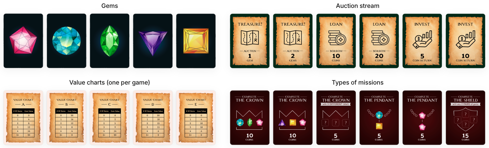

Full rules

* goal: obtain the highest final score.
* setup: each of the 3 players starts with 35 coins and a private hand of 5 gems. An auction deck is shuffled, 4 missions are revealed and fixed for the game, and one Value Chart remains public throughout.
* auction types:
  * treasure: bid to add the revealed center gem(s) to your collection.
  * loan: take coins now, repay at the end during scoring. Loans are the only way to bid above your current coins.
  * investment: pay your bid now (coins locked); at scoring, you get the bid back plus the bonus.
* missions: each requires a combination of gems won in auctions. A mission can be claimed only once, by the first player who completes it. The reward is paid out at final scoring.
* each round: flip the top auction card and have everyone submit a sealed bid simultaneously; the highest bid wins, with ties broken by turn order (the winner moves to the back of the line). The winner takes the auction payoff, then reveals one gem from their private hand to the public Value Display.
* value display: a public pool of gems that players reveal from their private hands. At the end, each player reveals their remaining private gems into the display. The terminal display is therefore fixed when the hands are dealt, although players reveal it gradually.
* gem values: each auctioned gem in a player’s collection is worth the amount dictated by the Value Chart, purely as a function of how many gems of that color appear in the Value Display. For example, with Chart A ($1 \to 4, 2 \to 8, 3 \to 12, \cdots, 5+ \to 20$) and 3 red gems in the display, 2 red gems in a player’s collection are worth $2 \cdot 12 = 24$ points.
* game end: the game ends when there are no more gems to auction, typically after 15–25 rounds.
* final score: coins left in hand + collection gem value + mission rewards − loan repayments + investment returns.

## examples

To understand the game better, let's walk through what a game might look like at six different points throughout the game.

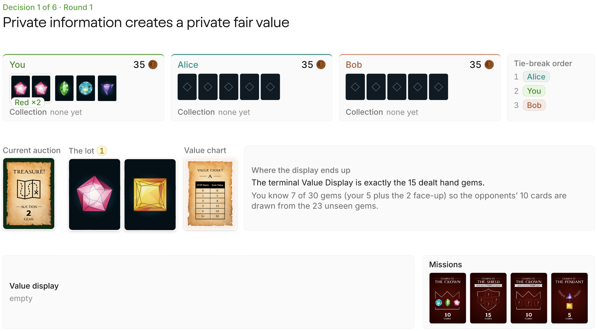

The 30-gem deck contains six gems of each color, and the terminal Value Display is the 15 gems dealt into players’ hands. From your five-card hand and the two face-up auction gems, 23 gems remain unseen and the opponents’ ten hand cards are drawn from them. Let $N_R$ and $N_Y$ be the terminal display counts for Red and Yellow, and $V$ the corresponding value dictated by the value chart A, which pays 4 points per displayed gem up to 5. Then, the EV is

$$
\begin{aligned}
\mathbb E[N_R] &= 2 + 10\left(\frac{3}{23}\right)=\frac{76}{23} \implies \mathbb E[V_R] = 4\mathbb E[N_R]=\frac{304}{23}\approx13.22\\
\mathbb E[N_Y] &= 10\left(\frac{5}{23}\right)=\frac{50}{23} \implies \mathbb E[V_Y] = 4\mathbb E[N_Y]=\frac{200}{23}\approx8.70\\
\mathbb E[V_{\mathrm{lot}}] &= \mathbb E[V_R]+\mathbb E[V_Y]
=\frac{504}{23}\approx21.91
\end{aligned}
$$

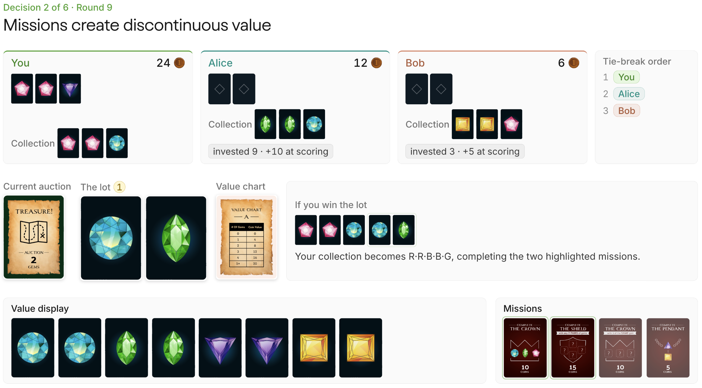

**Missions create discontinuous value.** Winning the Blue–Green auction changes your collection to Red–Red–Blue–Blue–Green, completing two of the missions for 25 points total. Factoring in the blue and green gems from the lot and their values on the display, we know that winning this lot is worth at least $25+2\cdot4+2\cdot4=41$. Because neither Alice nor Bob has more than 12 coins and you are first in tiebreak order, you can win the auction for 12 and earn at least $41-12=29$ in positive EV. Their lack of liquidity lets you take the auction much more cheaply.

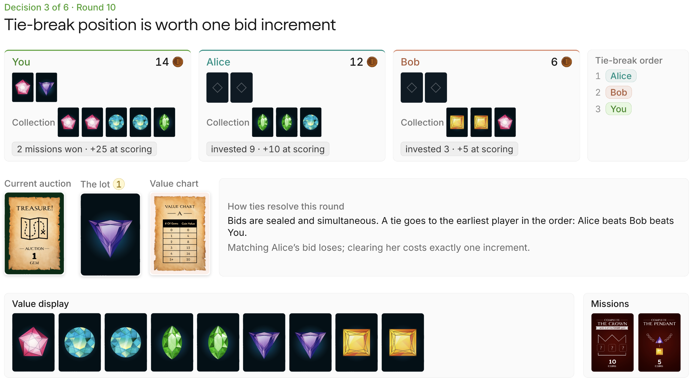

**Tiebreak position is worth one bid increment.** Because you are last in tiebreak order, matching Alice’s bid is a losing action: to clear a predicted bid of $b$, you must bid $b+1$. Alice can bid at most 12 and Bob at most 6, so 13 is the minimum bid to guarantee the lot. However, this increase must still be weighed against the gem’s value and the option value of keeping that coin for the remaining auctions; it may make the lot no longer worth bidding on.

<strong>Decision 4: a reveal moves the market, not the terminal supply</strong>

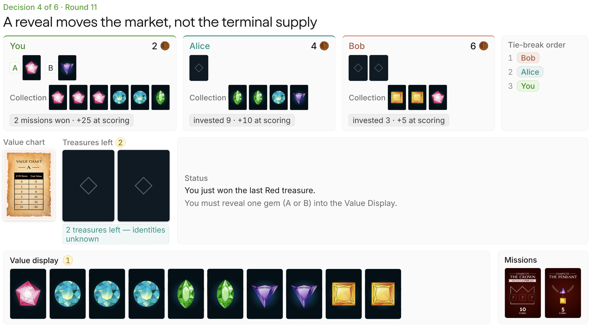

Both cards enter the Value Display at game end, so revealing Red or Purple does not change final gem values, but **it changes what other players are willing to pay before then**. Revealing Purple moves its public count from 2 to 3 and its current quote from 8 to 12. Bob already owns Yellow gems, so another Purple would also complete the 5-point Pendant mission. This reveal raises his visible reservation value for a future Purple from roughly $8+5=13$ to $12+5=17$. That can be useful if the goal is to induce Bob to spend his six coins, but it also makes a strategically important Purple harder to buy or deny, especially when you have only two coins and act last in ties.

Revealing Red has the opposite advantage. Moving Red’s quote from 4 to 8 has a null effect on public perception because there are no more red gems to be auctioned off (all 6 are either in a collection or will be in the value display). It also keeps Purple quoted at 8 while your hidden Purple guarantees that its terminal supply is higher than the table can see. This usually makes Purple easier to snipe later (for example, to block Bob's pendant). Revealing Red does advertise more of your lead (making you a bigger threat to other players who want to block you), but its direct price impact is confined to a market that has already closed.

<strong>Decision 5: a loan is worth its liquidity, not its face value</strong>

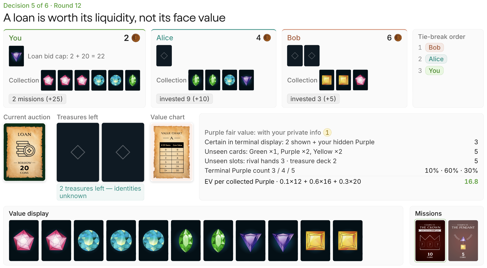

The 20 borrowed coins are matched by a 20-point repayment at scoring, so the principal itself creates no terminal value. Winning the loan for 10 changes your available cash to $C_{\mathrm{after}}=2+20-10=12$, but carrying those coins to the end would leave you 10 points worse off. For example, if you win and have 14 coins, you can guarantee winning the last two auctions by first paying 7 (beating Bob in the tiebreak) and paying 7 again (since you just won, you are last in the tiebreak and need to one-up Bob's liquidity of 6). An argument against this is that loans are worth less because there are fewer auctions remaining in which to deploy the borrowed liquidity, and that if you bid too high, using the surplus may not guarantee positive EV.

Of the five cards still hidden, two are Purple, and three cards belong to rival hands while two are treasures. Let $X$ be the number of those two Purple cards in the three rival-hand slots, then $\Pr(X=x)=\frac{\binom{2}{x}\binom{3}{3-x}}{\binom{5}{3}}$. Therefore, $\Pr[X=0]=0.1$, $\Pr[X=1]=0.6$, and $\Pr[X=2]=0.3$.

$$E[V_P]=0.1(12)+0.6(16)+0.3(20)=16.8$$

With 2 coins, under rational play by your opponents, you would never be able to win the last two auctions. But for the reasons explained above, the loan gives you an out to win these last two, and because the EV suggests a positive trade, it is worth winning the loan auction.

<strong>Decision 6: late-game bidding becomes auction poker</strong>

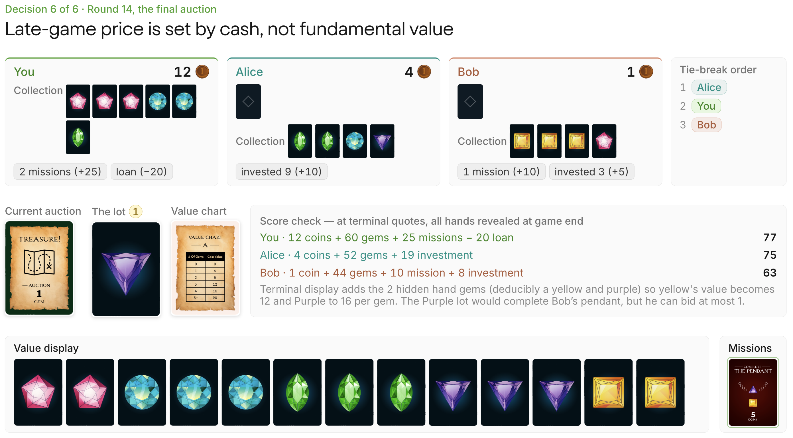

Before the final lot, terminal-value accounting puts you at 77, Alice at 75, and Bob at 63. The Purple gem is worth 16 on Chart A; it would also complete Bob’s 5-point Pendant mission, but Bob has only 1 coin. The score branches are:

$$
\begin{aligned}
S_{\mathrm{Bob}}(1) &= 63+16+5-1=83\\
S_{\mathrm{Alice}}(4) &= 75+16-4=87\\
S_{\mathrm{You}}(5) &= 77+16-5=88
\end{aligned}
$$

Your tie priority beats Bob, so a bid of 1 covers his branch. Alice, however, acts before you so 5 is the smallest bid that covers both stacks. Any bid from 6 through 12 buys the same gem while needlessly giving away score. The asset is fundamentally worth 16, but the correct price is 5 because the opponents’ remaining cash sets the clearing threshold.

## the option value of a coin

At face value, a coin contributes one point to final score. During the game, its real value is the best thing you can still do with it. You can buy the current lot, wait for a later auction where the coin goes further, sink it into an investment, or use it to deny an opponent a loan. You have the right but not the obligation to spend the coin, which makes liquidity option-like. 

The timing effect cuts both ways. Early in a game, holding a coin preserves many possible uses across the remaining deck. Late in a game, if valuable lots remain and the other players are nearly broke, the same coin can carry unusual market power because few rivals can contest it. Whoever preserves liquidity can buy the last useful lots at lower clearing prices. The relevant quantity is the continuation score lost when that coin is spent in the current state, which can exceed its face value. Much of the project eventually reduces to estimating, approximating, or teaching that distinction.

## why MegaGem is hard for self-play

Several well-known RL systems use self-play: [AlphaGo](https://www.nature.com/articles/nature16961) in Go, [AlphaZero](https://arxiv.org/abs/1712.01815) in Go and chess, [AlphaStar](https://www.nature.com/articles/s41586-019-1724-z) in StarCraft II, [OpenAI Five](https://arxiv.org/abs/1912.06680) in Dota 2, [Pluribus](https://doi.org/10.1126/science.aay2400) in poker, and [KataGo](https://arxiv.org/abs/1902.10565) in Go. The broad recipe is to train an agent against copies or historical versions of itself (known as fictitious self-play) and reward successful play. Opponents therefore co-evolve with the learner, creating an automatic curriculum without a fixed external teacher. Self-play also works outside two-player zero-sum (2p0s) games, but it's cleanest in that setting. Unfortunately, MegaGem removes those conveniences one by one.

Another complication is that the policy to be trained is an LLM, not a policy head that emits one move. Consider AlphaGo again, which uses search with policy and value networks to select a single legal board action. Now contrast this with temperature sampling in LLMs that operates across an autoregressive response, so response entropy accumulates very quickly. Now a game-level reward must assign credit through a long natural-language trajectory, and many distinct responses can collapse to the same parsed bid. This has one small benefit: because we don't use temperature 0, the policy is stochastic and therefore less exploitable than a deterministic policy.

<strong>2p0s games</strong>

Chess, Go, and heads-up poker are standard examples. One player’s gain is the other’s loss, so a value function $V(s)$ can describe the expected outcome from a position for either player, with the sign reversed for the opponent. This is the same object visualized by the evaluation bar beside an online chess board.

Under pure opposition, you must assume the opponent chooses whatever hurts you most. You therefore choose the strategy with the best worst case, the maximin. Your opponent does the converse, minimizing the maximum value you can obtain, the minimax. [Von Neumann’s minimax theorem](https://en.wikipedia.org/wiki/Minimax_theorem) says these values are equal.

If neither player can improve by deviating alone, the joint policy is in Nash equilibrium. In a 2p0s game, its equilibrium strategies are also minimax. This supplies a clean progress measure: exploitability, or how much a worst-case opponent could gain by deviating. A lower exploitability means the strategy is becoming harder for any opponent to exploit.

Ordinary policy-gradient self-play can still cycle (think of rock-paper-scissors) in the latest policy. Practical systems therefore often average policies or train with fictitious self-play, exploiters, and wider populations, and these mechanisms can stop the fresh policy from forgetting old weaknesses.

<strong>two-player general-sum games</strong>

General-sum games remove the requirement that the players’ payoffs add to a constant in every outcome.

1. In mixed-motive games, interests are neither perfectly opposed nor perfectly aligned. In the prisoner’s dilemma, both players prefer mutual cooperation to mutual defection, but each is individually incentivized to deviate. Settlers of Catan has the same flavor through beneficial trades, temporary coalitions, and coordinated attempts to block (or "plow") a leader.
2. In fully cooperative games, every player receives the same payoff. Self-play can still learn arbitrary private conventions that fail when a new partner has learned a different convention. Hanabi is the standard example: two policies can each be effective with copies of themselves yet coordinate poorly with one another.

If you’re interested in the cooperative side of multi-agent RL, Arturo wrote a great [hands-on account of training LLM agents to play Hanabi](https://nphard.io/2026/02/23/hanabi.html), including the communication conventions that emerge under self-play.

General-sum rewards give each player a different value for the same position. Multiple equilibria may exist, so different conventions or tradeoffs are common.

<strong>three-player general-sum</strong>

MegaGem adds more players. Score changes are not constrained to sum to zero, and an action can redistribute advantage among players in ways that barely affect the actor. A losing player can decide which leader wins. Two players can pressure the leader without sharing a formal team reward.

A single optimal bid also breaks down because best play is contingent on opponents. Against a player who always bids 0, bidding 1 wins cheaply; against a rational player, the same bid loses. If a kingmaking action barely changes the acting player’s own reward, a policy-gradient update receives almost no direct signal for which rival benefits.

We can measure deviation gains around a specified joint policy. No unique opponent-independent strategy supplies a universal reference point. In a general-sum game, the word “improvement” must name an opponent distribution, equilibrium-selection rule, or population game. The self-play reward describes the population that produced it.

<strong>chance, hidden state, and revelation</strong>

First, deals are stochastic. A strong hand can raise terminal score without reflecting a better decision, just as pocket aces can make a poker hand profitable without proving that every action was skillful. Same-deal comparisons remove much of this variance.

Second, MegaGem has imperfect information. A player observes an information state consisting of its private hand and the public history; the hidden state remains unknown. Formally, the observation defines a set of hidden worlds still consistent with what the player has seen. New bids and reveals update the player’s belief over those worlds. A poker four-bet leaves the cards hidden while shifting the belief toward stronger hands.

This makes MegaGem a partially observable Markov decision process (POMDP) because the relevant value depends on the full belief state, not just the current board. This creates a larger state space that is harder to estimate from.

Because bids are simultaneous, action selection also requires a distribution over clearing prices. For a candidate bid $b$, we need $P(\text{win}\mid b)$, the probability that the bid beats both opponents. Every bid trades the surplus retained after paying against the probability of winning.

Also, terminal gem values are fixed by the initial deal but revealed endogenously through play. Every private gem eventually enters the public Value Display, so the final display does not change. The order of reveals changes what each player believes before the remaining auctions. A reveal can therefore move perceived value even when it does not move terminal value.

For the common-value component of a lot, winning also carries information. If both opponents decline to pay your price, you may have overvalued the asset, the auction version of the winner’s curse. Private mission value weakens that inference because the same lot can rationally be worth different amounts to different seats.

## environment

Using Prime Intellect's [verifiers](https://github.com/PrimeIntellect-ai/verifiers), we build the [RL environment](https://app.primeintellect.ai/dashboard/environments/djdumpling/megagem) around LLM clients playing one another. To reduce context cost, a game runs as chained single-turn interactions. On every round, each player receives all information available to that seat, including the public state, their private hand, and the public history of the last five auctions. The model returns a structured response; the environment parses the bid, resolves the winner, and prompts that player again if a gem reveal is required. Each game emits a trajectory containing the prompts, responses, parse and legality telemetry, bids, public state, final scores, and the seed needed to reconstruct the deal. The same trajectories support evaluation and self-play rollouts.

The environment emits complete game trajectories without defining the RL reward. A separate offline scorer reconstructs per-turn credit, and the update masks every opponent token so only the trainable seat receives gradients.

## evaluation design

Experimental design determines which triples play, on which deals, and in which seats. Estimation derives scalar Elo and confidence intervals. The benchmark uses three measurements that should not be conflated:

- **Elo**: full-field latent strength determined from three-way rankings, used in the final leaderboard
- **first-place rate**: fraction of games a policy wins (33.3% is average), used in validation panels
- **pairwise finish-above rate**: fraction of shared games in which policy A finishes above policy B, used for model-to-model claims

For balanced Elo estimation, we use a Steiner triple system, which places every pair of models in exactly one triplet. With 13 models, this produces $\frac1{3} \cdot \binom{13}{2} = 26$ triplets. Each triplet plays on 8 seeds, and on each seed the models rotate through all 3 starting hands. The benchmark therefore contains $8 \cdot 3 \cdot 26 = 624$ games, or $624 \cdot \frac{3}{13}=144$ games per model.

Given a strict finish $i\succ j\succ k$ and positive rating $\gamma$, the Plackett-Luce model assigns this ordering probability

$$
P(i\succ j\succ k)
=\frac{\gamma_i}{\gamma_i+\gamma_j+\gamma_k}\cdot
\frac{\gamma_j}{\gamma_j+\gamma_k}
$$

Fitting Plackett-Luce with majorization–minimization (MM) iteration

[MM iteration](https://projecteuclid.org/journals/annals-of-statistics/volume-32/issue-1/MM-algorithms-for-generalized-Bradley-Terry-models/10.1214/aos/1079120141.full) fits a lightly regularized Plackett-Luce model. The model factors each final ranking into rank selections. In game $g$, let $Z_{g,r}$ be the summed strength of the models still eligible at ranking position $r$; for the ordering above, $Z_{g,1}=\gamma_i+\gamma_j+\gamma_k$ and $Z_{g,2}=\gamma_j+\gamma_k$, the two denominators in $P$. We add 0.1 virtual wins and losses against a strength-1 anchor to stabilize finite samples. Let $W_i = 0.1 + \#\{\text{games in which } i \text{ does not finish last}\}$. Initialize $\gamma_i=1$ and repeat until convergence:

1. recompute every remaining strength $Z_{g,r}$ from the current $\gamma$
2. form each model's *exposure* $D_i = \frac{0.2}{\gamma_i+1} + \sum_{g,r}\frac{\mathbb 1[\,i\text{ remains eligible at rank }r\text{ in }g\,]}{Z_{g,r}}$
3. update $\gamma_i \leftarrow W_i/D_i$
4. rescale the $\gamma_i$ to geometric mean 1

Finally, take $\theta_i = \ln\gamma_i$, center them on the field mean, and convert at the standard $\frac{400}{\ln 10} \approx 173.7$ points per logit. For example, “1275 Elo” is 275 points above the fitted center.

To quantify uncertainty, we bootstrap *matchup-on-deck clusters*, each of which contains the three seat rotations of one triple on one deal. Resampling whole clusters preserves the correlation introduced by a shared deck. We report 95% confidence intervals.

The observed cyclic component is indistinguishable from finite-sample noise. No statistically resolved triple forms a directed cycle, and the Elo rankings are stable. To compare two models A and B directly, we simply determine how often A beats B in games where both appear, which removes more deck variance because it is a paired statistic.

## data and SFT

The base Qwen3-4B-Instruct is sufficiently coherent to parse but strategically awful. It spends almost all its coins, completes few missions, and hallucinates a gem outside its private hand on roughly 2–5% of reveal turns.

| teacher | full-field mean score | self-play mean score | visible rationale length |
|---|---:|---:|---:|
| Gemini 3 Pro | 82.5 | 68.7 (-14.3) | 207 words |
| Gemini 3 Flash | 80.4 | 69.4 (-11.0) | 230 words |
| Claude Opus 4.5 | 77.3 | 73.1 (-4.2) | 327 words |
| Claude Opus 4.6 | — | — | ≈421 words |

We choose the teachers on two criteria:

- **skill:** The initial screen, run before the final Elo ranking, compares Gemini 3 Pro, Gemini 3 Flash, and Claude Opus 4.5. A full-field score can conflate strategic skill with exploiting weaker opponents, so we also run a 24-game-per-model probe with three copies of each model. Clone-game scores also reflect how a policy changes total surplus, so we use this result only for screening.
- **length and cost:** Gemini 3 Flash is about fourteen times cheaper per game than Claude Opus. A blend supplies enough long rationales to diversify the data without making every game Opus-priced.

For production collection, we keep Gemini 3 Flash and replace the screened Claude Opus 4.5 with its newer Claude Opus 4.6 successor. We choose the successor based on model family; the screen itself tests only Claude Opus 4.5. The final corpus uses 70% Gemini 3 Flash and 30% Claude Opus 4.6. Claude Opus 4.6 averages about 421 visible words, estimated from 561 billed tokens, while the resulting corpus averages about 324 tokens under the student tokenizer. The table and those corpus statistics therefore use different units.

### dataset

Keeping only the winner’s traces would waste data and select the luckiest copy of an otherwise identical policy. It would also remove the lower liquidity and slower tempo states that Qwen3-4B-Instruct needs to handle. So instead, we consider the top two models' traces from each game while removing unparseable or illegal turns (only 10 training turns fail those validity gates). The final split contains:

| split | teacher games | examples | bid turns | reveal turns |
|---|---:|---:|---:|---:|
| train | 150 | 6,153 | 4,990 | 1,163 |
| validation | 10 | 420 | 342 | 78 |

Training uses a LoRA with rank 32, alpha 64, and dropout 0.05, applied to the attention and MLP projections. Sequence length is 4,096; effective batch size is 16; the learning rate is $2\times10^{-4}$ with cosine decay and 50 warmup steps. We train for 1,200 optimizer steps, or roughly three epochs, save an adapter every 200 steps, and merge the adapters from steps 1,000 and 1,200 into separate base checkpoints.

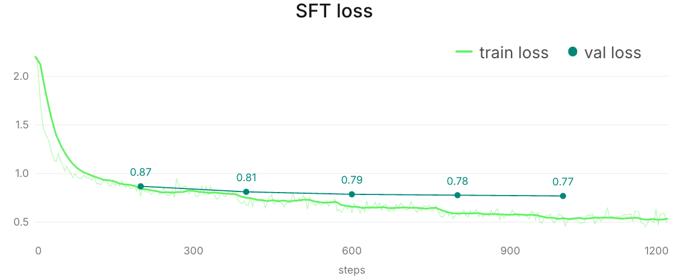

Checkpoint selection uses the 10 validation seeds and a panel comprising Gemini 3 Flash, Claude Opus 4.6, Claude Sonnet 4.5, Llama 4 Maverick, Intellect-3, and GPT-OSS-120B. Qwen faces two copies of each named opponent and occupies all three seats on each of 10 deals, for $6\times10\times3=180$ panel games, plus 10 self-play games.

| checkpoint | panel first-place rate | vs two Claude Opus 4.6 copies | parseable | illegal reveal | self-play mean score |
|---|---:|---:|---:|---:|---:|
| base Instruct | 2.8% | 0.0% | 99.6% | 5.3% | 59.77 |
| SFT step 1,000 | 61.7% | 16.7% | 100% | 0.9% | 64.27 |
| SFT step 1,200 | <strong style="color:#00aa00">64.7%</strong> | <strong style="color:#00aa00">50.0%</strong> | 100% | 0% | 61.63 |

Step 1,200 becomes the obvious checkpoint choice. The self-play mean should only be considered as a sanity check because of the co-evolving argument, and it still shows that the model hasn't degenerated.

## self-play results

Across a reconstructed audit set of 7 mainline GRPO configurations, the two runs played against the SFT checkpoint remained flat. Several others improve against a fixed scripted heuristic, demonstrating opponent-specific learning. Because five configurations did not record the same stationary anchor, those gains don't measure transfer.

In each run, one seat is trainable while the other two come from some mixture of frozen SFT, lagged snapshots, a scripted heuristic, and external models. For each seed, seat assignment, and opponent table, the trainable policy plays the same deal $K=8$ times with different sampled responses. Each fresh rollout batch supports six optimizer steps.

### transfer metrics

Because first-place rate among three evolving, co-adapting copies remains approximately $\frac1{3}$ regardless of how much the policy evolves, population-based reward isn't sufficient. Instead, we need an anchor, and the initial SFT policy is the perfect choice.

The evidence uses two instruments, which should not be conflated:

- The scripted-heuristic gate compares a GRPO checkpoint with frozen SFT on matched deals. It detects whether training finds that opponent’s weakness.
- The frozen-SFT anchor measures the learner throughout training against the unchanged step-0 policy. Only two mainline runs record this stationary anchor.

The configurations use the same DAPO-style clipped objective; the labels below describe what changed in the training pool or schedule. **Snapshots** are lagged copies of the learner, and **SFT anchor** is the frozen step-0 policy. The two snapshots-plus-Flash rows are separate replications of the same basic pool. The frontier-API pool substitutes Gemini 3.1 Pro, Claude Opus 4.6, and Claude Sonnet 4.5; the 400-step run doubles the usual training horizon; seat rotation moves the learner through all three seats; and the final mixed pool combines the SFT anchor, lagged snapshots, and a decaying scripted-heuristic share. The figure abbreviates that final pool as “heterogeneous.”

| GRPO configuration | scripted-heuristic $\Delta$ own score vs SFT (95% CI) |
|---|---:|
| snapshots + Flash (replication 1) | +4.64 [2.68, 6.57] |
| snapshots only (400 steps) | +16.48 [14.26, 18.93] |
| snapshots only (replication) | +4.36 [2.89, 5.88] |
| snapshots only + seat rotation | +4.04 [−3.88, 11.88] |
| snapshots + Pro/Opus/Sonnet | −2.07 [−3.89, −0.31] |
| snapshots + Flash (replication 2) | −1.16 [−3.22, 0.89] |
| SFT anchor + snapshots + heuristic | +0.65 [−1.14, 2.43] |

The heuristic contrasts use 60 matched seed groups with eight samples each, except the 24-game seat-rotation diagnostic. The optimizer can learn a narrow exploit.

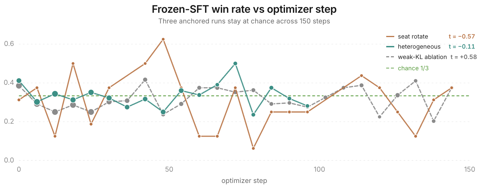

None of these results rules out a richer league design. In the directly anchored SFT-anchor mixed-pool run and the later weak-KL ablation, opponent mixing and weaker KL likewise fail to produce a positive anchor trend.

### GRPO objective

For player $i$, playing against $j$ and $k$, define competitive margin as $m_i=s_i-\frac{s_j+s_k}{2}$. The terminal reward is

$$
R_i^{\text{terminal}}
=\tanh\left(\frac{m_i}{19.6}\right)+0.1 \cdot \mathbf 1[i\text{ wins}]
$$

We calibrate the scale 19.6 so the median absolute margin maps to 0.5 via $\tanh\left(\frac{10.75}{19.6}\right) \approx 0.5$. This compresses extreme wins and losses while preserving their order via monotonicity. We add a shaping channel (weighted by 0.01) that assigns intermediate credit from reconstructed public-score changes between rounds. Then, a terminal correction aligns its cumulative accounting with the final margin. Illegal actions receive $-0.5$.

Let $r_u$ denote the terminal, legality, or shaping reward assigned at turn $u$. For each trainable turn $q$, define the return $G_q=\sum_{u\ge q}r_u$ and subtract an exponential-moving-average baseline $b_q$ indexed by game phase and seat role. Let $\mathcal G$ contain all trainable turns from the eight sibling games. Then, we define the advantage here as

$$
A_q=\frac{(G_q-b_q)-
\operatorname{mean}_{v\in\mathcal G}(G_v-b_v)}
{\operatorname{std}_{v\in\mathcal G}(G_v-b_v)}
$$

Only turns from the trainable seat receive gradients.

<strong>optimizer health</strong>

We sample at temperature 1.0 and top-$p=0.95$, then update a rank-32 LoRA with learning rate $10^{-5}$ and KL coefficient 0.01.

The SFT-anchor mixed-pool run completes 100 optimizer steps with 192 games per rollout generation. Together, a dead adapter, broken reward ordering, or format collapse become poor explanations for the null effect.

| diagnostic | SFT-anchor mixed-pool run |
|---|---:|
| mean KL from reference | 0.0037 |
| maximum KL | 0.0061 |
| mean PPO ratio clip fraction | 0.0012 |
| advantage variance | 0.81 |
| zero-standard-deviation groups | 0 |
| advantage↔terminal-margin Spearman | 0.902 |
| training parse failures | 5 / 66,649 |
| final-eval illegal actions | 0 / 480 |

<strong>PPO and choosing not to pursue rollout-based action values</strong>

A second problem is assigning those wins to individual decisions.

### trajectory-level credit

GRPO is easy to engineer in this setup. Its statistical fit is weak for this task. It avoids training a separate critic, yet this setup is far from the typical single-turn GRPO task. A game lasts roughly 15–25 rounds of interleaved bids, reveals, loans, and investments. Most reward arrives at the end, so an early bid and a late reveal can inherit nearly the same verdict even though either may have changed every state that follows. The same-deal comparison removes hand luck. It leaves within-trajectory credit unresolved.

We don't claim that GRPO cannot work on long-horizon or multi-turn tasks. Dense verifiable rewards, process supervision, much larger groups, or environments in which one decision dominates the outcome can still make trajectory-level comparison useful.

### state-value probe

For each fixed board $b$, let $\bar Y_b$ and $s_b^2$ be the sample mean and within-board variance of its rollout returns. Because the observed variance of board means includes finite-sample noise, we estimate the true between-board variance as

$$
\hat\sigma^2_{\text{board}}
=\max\left(0,
\operatorname{Var}_b(\bar Y_b)-\frac{\mathbb E_b[s_b^2]}{K}
\right)
$$

with within-board variance $\hat\sigma^2_{\text{trajectory}}=\mathbb E_b[s_b^2]$. In the probe, 99.8% of the estimated variance lies among trajectories from the same board, while only 0.2% lies between corrected board means. The within-board term contains both action effects and continuation noise; it isn't a clean action signal. A state-value critic must learn the much smaller between-board component from labels dominated by within-board variation.

Under relative-margin self-play, all three copies benefit from the same favorable deal, which suppresses most common board advantage. The fixed-heuristic probe allows repeated outcomes to recover more of the position’s value.

The probe argues against learning $V(I)$ from these particular relative-margin labels but doesn't rule out state values in general. However, an action-conditioned value $Q(I,a)$ remains viable because it could still distinguish bids within the same state.

### rollout-$Q$ distillation with piKL

The first plausible fix is a [piKL](https://arxiv.org/abs/2210.05492)-style target, inspired by Meta’s work on Diplomacy, a seven-player game outside the 2p0s setting. It builds a search distribution that favors bids with higher action value $Q(I,a)$ while paying a KL penalty for moving too far from the SFT policy. Here, $Q(I,a)$ means the expected outcome after taking bid $a$ from information state $I$ and playing the game to completion.

We estimate $Q$ by simulation. The acting player cannot see the opponents’ hands or the undealt deck order, so we sample several *worlds* $w$: complete assignments of the hidden information that remain consistent with the player’s hand and the public history. In each world, we force candidate bid $a$, let the SFT continuation policy $\pi$ finish the game in the acting seat while policy $\omega$ controls the opponents, and read off the terminal score margin:

$$
Q_{\pi,\omega}(I,a)=\mathbb E_{w,\,\xi}\left[\tanh\!\left(\frac{m_{\text{terminal}}}{19.6}\right)\right]
$$

Here, $\xi$ is the continuation of the game generated by $\pi$ and $\omega$. We score every candidate on the same sampled worlds to reduce variance. The estimate $Q$ still depends on $\omega$ because changing the continuation opponent can reorder bids even when $(I,a)$ stays fixed.

piKL combines these action values with sampled action frequencies $\hat\tau$ from the SFT policy, upweighting high-$Q$ bids while remaining KLed to the SFT policy:

$$
\pi_{\text{piKL}}(a\mid I)\;\propto\;\hat\tau(a\mid I)\,\exp\!\left(\frac{Q(I,a)}{\lambda_{\mathrm{KL}}}\right)
$$

The temperature $\lambda_{\mathrm{KL}}$ controls the strength of the anchor. As $\lambda_{\mathrm{KL}}\to\infty$, the $Q$ tilt vanishes and the distribution returns to the SFT frequencies $\hat\tau$; as $\lambda_{\mathrm{KL}}\to0$, it concentrates on the sampled candidate with the largest $Q(I,a)$. The $\lambda_{\mathrm{KL}}=0$ arm in the table implements that limiting argmax directly.

We label decisions with this $Q$, build piKL targets at several $\lambda_{\mathrm{KL}}$ values, and distill them with LoRA SFT. Each candidate then occupies every seat against two frozen SFT copies over the same 120 games, 40 per seat.

| $\lambda_{\mathrm{KL}}$ | first-place rate | mean margin (95% CI) | paired Δ margin vs $\lambda=\infty$ (95% CI) |
|---:|---:|---:|---:|
| $\infty$ | 0.425 | +1.23 [−2.21, 4.68] | — |
| 1 | 0.417 | +2.73 [−1.06, 6.51] | +1.49 [−3.37, 6.35] |
| 0.3 | 0.317 | −1.38 [−4.72, 1.95] | −2.62 [−7.12, 1.89] |
| 0.1 | 0.292 | −1.79 [−5.06, 1.48] | −3.02 [−7.55, 1.51] |
| 0 | 0.350 | −0.25 [−3.64, 3.13] | −1.49 [−6.37, 3.40] |

Mean-margin arm intervals use the normal approximation; paired intervals use a $t$ interval over matched games.

At 40 bid nodes with up to six candidates each, changing only the continuation opponent from self-play to base Qwen reduces median action-rank correlation with the self-play ordering from 1.0 to 0.43, while top-action agreement falls from 100% to 27.5%. The sign of each candidate’s advantage over the reference bid still agrees 72.5% of the time. The probe is too small, and the alternative opponent too weak, to establish the mechanism by itself. It does show that fine $Q$ rankings can depend strongly on the continuation policy.

A second five-arm sweep replaces the self-play continuation with Gemini 3 Flash. Relative to its $\lambda=\infty$ control, the $\lambda=1$ and argmax contrasts are +6.10 [0.38, 11.82] and +5.81 [0.70, 10.93]. These comparisons are exploratory, uncorrected for multiplicity, and unreplicated.

On a separate 43-node offline proxy, aggregating $Q$ over five fixed continuation types also never beats the single-self-play-$Q$ baseline. This diagnostic uses an offline proxy and provides no live policy comparison.

## action-critic pilot

GRPO’s group return cannot identify which bid changes the outcome. PPO could instead update from an action-specific advantage supplied by a learned critic. Before paying for an actor update, we test whether such a critic can rank candidate bids reliably enough to be useful.

### critic target

The actor produces a bid using $I$ before the opponents’ bids are known. Once the auction resolves, those bids become public. During training, a critic can use this newly revealed information even though the actor never receives it at inference (centralized training with decentralized execution). We can fix the observed opponent bids $\mathbf b_{-i}^{\mathrm{obs}}$ to determine what happens when only our bid changes.

$$
Q^{\mathrm{obs}}_{\pi,\omega}(I,a)
=Q_{\pi,\omega}\!\left(
I,a\mid\mathbf b_{-i}=\mathbf b_{-i}^{\mathrm{obs}}
\right)
$$

Most raw $Q$ variation reflects whether the state itself is favorable. To isolate differences among bids, we center each target over the retained candidate set $C(I)$:

$$
\widetilde Q_C(I,a)=Q^{\mathrm{obs}}_{\pi,\omega}(I,a)
-\frac{1}{|C(I)|}\sum_{a'\in C(I)}
Q^{\mathrm{obs}}_{\pi,\omega}(I,a')
$$

This target centers candidates with equal weight. A PPO update would instead require an advantage weighted by the actor policy.

### rollout labels

At each treasure-bid state reached by the actor, we sample $K=16$ bids and compress them to 6 diverse candidates. The selection retains the played bid while approximately preserving both the policy’s sampled mass and the numerical range of bids. We score every candidate on the same sampled worlds and random seeds, and hold the opponents’ observed bids fixed. After the forced bid, a deterministic frozen SFT policy completes the game. The labels therefore apply to that frozen continuation policy; an updated PPO actor would induce a different distribution.

### world-sampling budget

For 32 games, we evaluate each candidate with $M=64$ hidden-world samples to get 379 bid states and ~1.5k candidate rows. Because smaller estimates reuse prefixes of the same 64 worlds, we can compare 4, 8, 16, or 32 worlds without further rollouts. "Pair-sign agreement" measures whether actions separated by a $Q$ gap of at least 0.05 and 95% paired sign confidence retain their ordering while regret measures how much reference $Q$ is lost by selecting the lower-sample-budget argmax.

| worlds | pair-sign agreement with $M=64$ | mean regret vs $M=64$ | 90th-percentile regret vs $M=64$ | all-state argmax agreement |
|---:|---:|---:|---:|---:|
| 16 | 95.45% | 0.0207 | 0.0770 | 55.3% |
| 32 | <strong style="color:#00aa00">99.77%</strong> | <strong style="color:#00aa00">0.0105</strong> | <strong style="color:#00aa00">0.0370</strong> | 71.1% |
| 64 | 100% | 0 | 0 | 100% |

Since the later training set retains confidently separated pairs, we adopt 32 worlds at half the rollout cost.

### structured-model probe

Across all 379 calibration states, the mean spread from worst to best retained action is 0.2149 in $\tanh$-margin utility, and the estimated best action improves 0.0931 over the SFT-weighted candidate mean. That second number is an in-sample rollout-oracle bound, not realizable policy uplift. The average gap between the top two is only 0.0599, and the SFT policy’s played action is already best 36.1% of the time.

Most candidate-$Q$ variation is irrelevant to choosing a bid: 84.8% lies between states, while only 15.2% separates actions within a state. To be clear, this split measures paired rollout-$Q$ estimates grouped by decision state while the earlier 99.8% figure measures raw whole-trajectory variation across replicas grouped by initial deal. PPO can use only the within-state component because a state-wide offset raises or lowers every candidate together.

Across 4 split seeds, 4-fold cross-validation fits small structured models to multi-action states from the $M=64$ reference labels. In the table, "uplift" is offline $Q$ improvement over the SFT candidate mixture.

Each row is a gradient-boosted tree fitted to the candidate-$Q$ labels. The centralized model receives the observed opponent bids, while the actor-visible model does not. Two negative controls either shuffle the targets or drop the candidate bid, leaving a model that can predict only common state value. “Filtered pair accuracy” scores only the confidently separated action pairs defined above.

| model | filtered pair accuracy | full-set argmax | mean $Q$ uplift vs SFT |
|---|---:|---:|---:|
| centralized context | <strong style="color:#00aa00">74.8–75.9%</strong> | 33.4–35.9% | +0.0268 to +0.0315 |
| actor-visible state only | 72.3–74.6% | 32.2–35.6% | +0.0272 to +0.0314 |
| shuffled-target control | 44.3–51.9% | 23.8–29.4% | −0.0309 to −0.0062 |
| no-action control | all ties | 23.2% | −0.0680 |

### 4B critic results

We reuse three confidence gates from calibration: gap $\ge0.05$, 95% sign confidence, and at most 6 pairs per state. The SFT-initialized critic's Bradley–Terry loss ranks the better bid above the worse one, while a Huber regression term trains the numeric centered value at weight 0.25. Each epoch run uses 543 training pairs, 210 validation pairs, and a learning rate of $10^{-5}$.

| critic | filtered pair accuracy | full-set argmax (75 groups) | mean grouped regret | $R^2$ on centered advantage |
|---|---:|---:|---:|---:|
| non-leaky linear-bid baseline | — | <strong style="color:#00aa00">40.0%</strong> | — | — |
| 1 epoch, seed 0 | 62.9% | 24.0% | <strong style="color:#00aa00">0.0989</strong> | −2.31 |
| 1 epoch, seed 1 | 59.5% | 25.3% | 0.1096 | −107.54 |
| 1 epoch, seed 2 | 64.8% | <strong style="color:#00aa00">34.7%</strong> | 0.1051 | −17.64 |
| 3 epochs, seed 0 | <strong style="color:#00aa00">66.2%</strong> | 25.3% | 0.1011 | −16.56 |

Even with the preregistered gates, every neural run misses the 55% argmax threshold and the 40% linear-bid baseline.

### compute decision

The next meaningful rung uses 128 games and roughly 1,485 decision states. It costs an estimated 328 H200-hours, with $\pm40\%$ uncertainty. Reaching 1,024 games and then evaluating on the sequestered 128-game final test approaches 3,000 H200-hours.

PPO could in principle improve beyond a fixed expert, but it must first compress expensive rollouts into small critic differences and then refresh them as the actor’s state distribution moves.

We therefore stop after the critic diagnostics: no production label corpus and no actor update.

## bid-distribution model

### point-prediction error

One final search variant keeps the terminal rollouts but replaces the opponents’ current bids with deterministic predictions from a fitted market model. The best arm changes paired margin by only +0.58 [−5.6, +6.8], therefore unresolved.

A separate diagnostic asks whether a much better point predictor would solve the problem. A gradient-boosted tree trained on ~3.2k logged Gemini 3 Flash bids reaches an out-of-fold mean absolute error (MAE) of 1.10 coins with essentially zero bias (all variance). However, it still predicts the wrong side of the actual win/loss threshold on 26.1% of auctions. 55% of auctions resolve within one coin, where Flash’s own sampling noise straddles the boundary even when the conditional mean is accurate.

### bid logs as market data

A corpus of policy-generated games contains two kinds of information:

1. a few terminal outcomes (one final margin per player), each noisily supervising a long sequence of actions against particular opponents;
2. thousands of local market observations of the form “given this public state, this policy bids $b$.”

GRPO uses the first at trajectory level, while the action critic tries to refine it to individual decisions. We model the second as a conditional price law $\hat F$. This law makes one sealed-bid auction inside the multiplayer game tractable. Given an estimated lot value and a distribution over opponent bids, we can score every legal bid by expected surplus.

A point model treats one predicted opponent bid as certain. A distribution instead asks what fraction of the predicted bid mass each candidate beats:

$$
U_{\hat F}(b)=(\hat V-b)\hat P_{\hat F}(\text{win}\mid b)
$$

Prediction error now shifts probability mass across outcomes. We develop the first version on Gemini 3 Flash logs, then test whether the SFT policy’s own bids can fit the same price law.

### value model

The acting player knows three useful quantities for color $c$:

* $\text{display}_c$: how many gems of that color are already public
* $\text{own hand}_c$: how many of that color remain in their own private hand
* $\text{collection}_c$: how many have been removed into public collections

There are six gems of each color in the game. Because the player’s remaining hand eventually enters the display, a live lower bound on the final count is $L_c=\text{display}_c+\text{own-hand}_c$. Collected gems never enter the display, so an upper bound is $U_c=6-\text{collection}_c$. An 11-feature classifier uses these bounds, reveal progress, and round number to predict the final count $n_c$, one of 7 values from 0 through 6. It never sees opponents’ hidden hands. The prediction also remains independent of the Value Chart until inference, when we convert the count distribution to points.

We split games 70% for fitting, 10% for calibration, and 20% for held-out testing. We use a ReLU MLP ($\mathbb{R}^{11} \to \mathbb{R}^{64} \to \mathbb{R}^{32} \to \mathbb{R}^{7}$) with an $L_2$ coefficient of $10^{-3}$. It trains for at most 300 iterations (patience of 10 and tolerance $1e-4$).

For a lot with colors $g_1,\ldots,g_r$, the head outputs the 7-way count distribution $\hat P(n_{g_i}=k\mid I)$. We map that distribution through the active chart to get each gem’s raw expected value, then apply an isotonic calibration map $f$ before summing the gems. This flexible one-dimensional correction curve can fix systematic bias while preserving monotonicity:

$$
\hat V_{\text{lot}}
= \sum_{i=1}^r f\!\left(\sum_{k=0}^{6}
\hat P(n_{g_i}=k\mid I)\operatorname{Chart}(k)\right)
+ \operatorname{MissionBonus}(\text{collection},\text{lot})
$$

Here $\operatorname{Chart}(k)$ is the eventual **per-gem** value when $k$ gems of that color appear in the final display. The mission term is computed exactly. Thus $\hat P$ is the classifier output, while $\hat V_{\text{lot}}$ is the calibrated value supplied to the selector.

### bid model

A histogram gradient-boosted regressor predicts each opponent seat’s conditional mean bid $\hat\mu_s(x)$ from 16 public features (e.g. coin count, lot size and displayed value, recent clearing prices, and tiebreak position). The frozen model uses 400 iterations, learning rate 0.05, depth 4, and $L_2$ regularization 1.0. We group 5-fold cross-validation by paired seed and fit on ~3.6k Gemini 3 Flash bid rows (compared to the earlier ~3.2k). The grouped out-of-fold MAE is 1.230 coins with bias +0.013; 69.4% of predictions land within one coin.

But we can go further. Instead, let $B_s$ be opponent seat $s$’s actual bid in the current auction. We retain every out-of-fold residual $\epsilon=B_s-\operatorname{round}(\hat\mu_s(x))$ and pool them into an empirical noise distribution. At inference, we shift those historical errors by the current predicted mean, round to integers, and clamp to the opponent’s legal budget. With $N$ stored residuals and current budget $c_s$,

$$
\hat P(B_s=z\mid x)=\frac{1}{N}\sum_{r=1}^N\mathbf 1\left[z=\operatorname{clip}\big(\operatorname{round}(\hat\mu_s(x)+\epsilon_r),0,c_s\big)\right]
$$

For clarity, suppose the current mean prediction is 8 and the residual law puts 20% of its mass at −1, 50% at 0, and 30% at +1. The implied opponent bids are 7, 8, and 9 with probabilities 0.2, 0.5, and 0.3. Bidding 9 is no longer treated as a certain win: it beats 70% of that distribution and wins or loses the 30% tie mass according to public tiebreak order.

With exact tiebreak handling, the probability that candidate bid $b$ beats opponent $s$’s unknown bid $B_s$ is

$$
p_s(b)=\hat P(B_s<b)+\mathbf 1[\text{wins tiebreak}]\hat P(B_s=b)
$$

Assuming the opponents’ remaining bid variation is conditionally independent, the probability of beating both factors as

$$
\hat P(\text{win}\mid b,x)=\prod_{s\ne i}p_s(b)
$$

This independence assumption is approximate. The public features already capture many shared causes of bidding, leaving the residual variation specific to each opponent. Modeling the full joint conditional distribution $P(B_1,B_2\mid x)$ would require substantially more data because the possible bid pairs form a much sparser outcome space.

We check ordinary chosen-action calibration on the games used for the myopic selector evaluation. Across ~1.8k seat-0 treasure bids against 2x Gemini 3 Flash opponents, mean predicted win probability is 40.3% and empirical win frequency is 36.2%. The model is close at the extremes but isn't as calibrated in several middle-probability bins, which should roughly be expected.

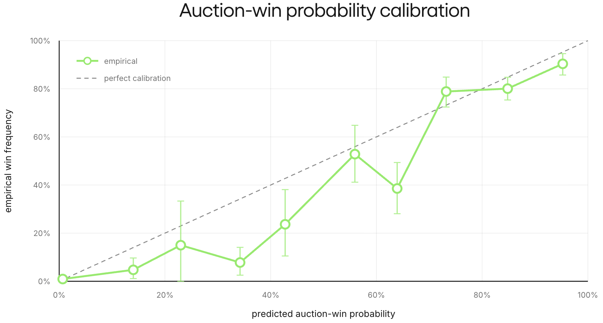

### offline regret

We collect 164 logged games in 82 seed clusters where the SFT policy plays against 2x Gemini 3 Flash opponents. The games yield ~1.8k seat-0 treasure decisions and ~3.6k opponent-bid rows (2 per decision). For each seat-0 decision, the final display reveals the treasure lot’s realized value $V$. Let $p$ be the highest recorded opponent bid. The ideal clearing-price surplus is $S^*=\max(0,V-p)$. For a counterfactual bid $b$, we resolve the auction against the *actual* logged opponent bids, giving realized surplus $S(b)=(V-b) \cdot \mathbf 1[b\text{ wins}]$. Then just define decision regret as

$$
R(b)=S^*-S(b)
$$

$R(b)$ captures two forms of decision regret:

* **Overpaying:** when a bid wins, regret is the surplus forfeited by paying above the cheapest winning price.
* **Passing:** when a bid loses a profitable lot, $R(b)=S^*$ is the surplus left on the table.

Zero regret can be unattainable when the budget cannot beat a profitable clearing price, or when $V>p$ but losing the tiebreak makes the cheapest winning bid $p+1$ instead of $p$. In fact, even the best oracle can therefore have positive regret because it is still limited by its available coin liquidity.

To isolate the price model, every counterfactual bidder receives realized terminal gem value $V$ and no mission bonus. Later, our selector replaces that privileged value with $\hat V$ plus exact mission value.

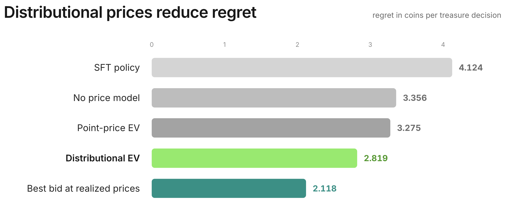

We compute regret differences within each seed cluster. The oracle beats the logged SFT bids by 1.304 coins per decision, while retaining residual uncertainty reduces regret by another 0.456 coins per decision relative to the point version using the *same fitted mean*.

## live failure of the myopic selector

Our selector first samples an ordinary SFT response, then calculates the EV curve for every legal bid and takes the argmax to get $b^*$. To prevent weak analytic preferences from overwriting coherent LLM behavior, it deviates only when the estimated improvement in immediate expected value is at least one coin:

$$
U(b^*)-U(b_{\mathrm{SFT}})=(\hat{V}-b^*)\hat{P}(\text{win} \mid b^*, x) - (\hat{V}-b_{\mathrm{SFT}})\hat{P}(\text{win} \mid b_{\mathrm{SFT}}, x)\ge1
$$

We compare three strategies: selector off, selector on, and selector on with history repair so future turns see a consistent record of changed actions. All three play the same 150 seeds against two Gemini 3 Flash opponents, with Qwen fixed in seat 0. We compare each treatment with selector-off on the same seed.

We introduce a control variate to reduce auction-resolution noise: a decision should not receive full credit because an opponent happens to sample below its usual price, or full blame because the opponent samples above it.

For each treasure decision $d$, let $y_d=1$ if the bid wins and $y_d=0$ otherwise, let $p_d$ be the model’s predicted win probability, and let $V_d-b_d$ be the lot’s estimated surplus. Define the decision-level resolution surprise as $x_d=(y_d-p_d)(V_d-b_d)$. This converts auction luck into score units: a surprising outcome matters more when the lot’s surplus is larger. For arm $a$, game $g$, and seat $k$, sum the surprises over that seat’s decisions:

$$
X_{a,g,k}=\sum_{d\in\mathcal D_{a,g,k}}x_d
$$

For the adjustment to be unbiased, the model must satisfy the stronger, value-weighted calibration condition

$$
\mathbb E[x_d\mid I_d]
=\mathbb E[(y_d-p_d)(V_d-b_d)\mid I_d]
=0,
$$

where $I_d$ is the information available at the decision. Ordinary calibration of $p_d$ alone isn't sufficient because the surplus $V_d-b_d$ varies across decisions. For each matched seed, define the seatwise luck contrast $Z_{g,k}=X_{\mathrm{on},g,k}-X_{\mathrm{off},g,k}$ and the paired margin difference $D_g=\text{margin}_{\mathrm{on},g}-\text{margin}_{\mathrm{off},g}$. We regress

$$
D_g=\tau+\sum_{k=0}^{2}\beta_k Z_{g,k}+\epsilon_g.
$$

The intercept $\tau$ is the adjusted treatment effect. In a paired pilot, this regression explains 42% of the paired variance, a 1.72× reduction. No direct validation of the stronger value-weighted calibration condition is available, so later gates report the raw paired effect as the primary evidence and the adjusted estimate as model-assisted corroboration.

Using the selector changes the margin by −5.01 points per game with 95% CI [−10.04, +0.02]. Adjustment removes about 3 points of adverse resolution luck, yielding −1.88 [−6.57, +2.81]. The adjusted history-repair arm is harmful at −5.16 [−9.90, −0.41]. All in all, neither converts the large regret reduction into a positive effect.

The table shows why:

| paired component | treatment minus control |
|---|---:|
| treasure spend | +6.81 |
| final gem value | +5.17 |
| mission rewards | +3.17 |
| loan repayments | +3.73 |
| investment returns | −7.13 |
| own final score | −3.61 |

Improving one-auction expected value harmed the full game because myopic spending depleted liquidity. Extra loan repayment and foregone investment returns together cost 10.9 points per game, overwhelming the gains from gems. The intervention also raised early clearing prices by 1.48 coins and lowered late prices by 1.04 after liquidity was depleted.

What's most suspect is the calibration error $\hat V$, which overstates realized lot value on this distribution, so perhaps the gate selects lots worth less than their price. But lots won on deviation and non-deviation decisions carry similar value bias. The one-coin gate isn't uniquely selecting overvalued lots and cannot explain the loss.

The table points to a more basic omission: myopic EV ignores the option value of a coin.

## pricing liquidity

Let $J(I_t,c)$ be expected continuation score from information state $I_t$ with $c$ coins, holding the rest of the state fixed. The marginal continuation value of the last coin is

$$
\lambda(I_t,c)=J(I_t,c)-J(I_t,c-1)
$$

We don't solve that dynamic program. Instead, $\lambda_{\text{coin}}$ approximates the part of $\lambda(I_t,c)$ above the one point already charged when cash leaves the final score. The corrected objective subtracts a fixed calibration offset $\delta$ from predicted lot value and charges that constant shadow premium for the future flexibility lost with every paid coin:

$$
U_{\delta, \lambda_{\text{coin}}}(b)
=\left[(\hat V-\delta)-(1+\lambda_{\text{coin}})b\right]
\hat P(\text{win}\mid b)
$$

The previous table shows why the premium must be positive: the invest and loan auctions move by roughly $\frac{3.73+7.13}{6.81}\approx1.60$ points for each extra coin of treasure spending.

We therefore sweep for configurations where we make reasonable interventions. The sweep contains a $5\times3$ grid over $\lambda_{\text{coin}}\in\{0.0,0.5,1.0,1.6,2.5\}$ and $\delta\in\{0.0,2.0,5.0\}$ at gate 1, plus three gate-only arms. Its margin-only best is $\lambda=1,\delta=0$ at +26.42 points. But every $\lambda\ge1$ arm enters a proxy-rescue regime where the selector overbids, and it gains by vetoing proposals that the live LLM does not make.

We therefore choose $\lambda=0.5,\delta=2$. During evaluation, it yielded +22.62 with 4.33 deviations per game.

### live evaluation

We measure the combined fix on 150 paired seeds against Gemini 3 Flash opponents.

| metric | control | paced selector | Δ (treatment − control) |
|---|---:|---:|---:|
| first-place rate | 36.0% | 59.3% | +23.3 percentage points |
| mean margin | −7.17 | +4.99 | +12.16 [7.61, 16.71] |

The model-assisted adjustment is +12.62 [8.28, 16.96]. Pacing also preserves the extra asset value while removing the financing damage:

| paired component | paced selector minus control |
|---|---:|
| treasure spend | −0.53 |
| final gem value | +5.44 |
| mission rewards | +2.77 |
| loan repayments | +1.00 |
| investment returns | −0.25 |
| own final score | +8.41 |

Treasure count changes by only +0.02 from control. The financing penalties collapse, and the early/late clearing-price cascade disappears.

This result applies to a gated treasure-bid intervention, not a complete game policy. The SFT model still handles treasure bids rejected by the gate, reveals, loans, and investments.

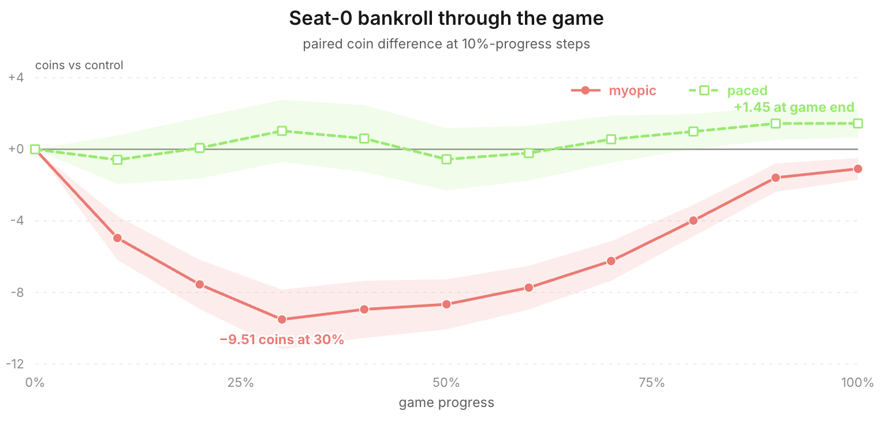

## refitting on SFT bids

The price law above is fitted on Gemini 3 Flash bids, making it an opponent-specific component built from deployment-policy data. We refit the same model family on roughly 1,800 SFT-policy bids, keeping $\lambda_{\text{coin}}=0.5$, $\delta=2$, and gate 1.0. This removes Flash bids from model fitting, although the three decision-rule constants still come from Flash-centered diagnostics.

On the Flash replay corpus, the SFT-fitted law retains 91% of the oracle-value offline regret improvement over the logged SFT bids: regret falls from 4.12 to 2.94, as opposed to 2.82. This shows similar decision utility on these logged auctions but not convergence between the policies.

Across 150 new paired seeds, the control’s first-place rate is 32.7% and the SFT-fitted selector reaches 50.7%. Raw paired margin improves by +8.47 [3.99, 12.94], while control-variate-adjusted margin improves by +10.19 [6.14, 14.24] with $t=4.93$.

The SFT-fitted price law reproduces the main fix, but at a smaller magnitude by retaining 81% of the Flash-fitted selector’s +12.62 points. Relative to control, the early/late market cascade does not reappear.

## distillation

### corpus

We play 400 fresh mixed-policy games. The analytic selector controls seat 0 using the SFT-fitted price law and gate, while the other two seats remain plain SFT policies. This holds the opponent policies fixed, although the selector’s bids can still change later budgets and market history.

The run produces ~4.7k bid decisions, including about 1,200 selector deviations. It also supplies another opponent-type check: the selector-augmented SFT policy finishes first against two SFT clones in 48.7% [43.9, 53.6] of games, above the $\frac1{3}$ baseline.

The SFT export contains three row types:

1. **deviations:** replace the SFT bid with the analytic expert’s target and expose the quantities that determine it: $\hat V$, opponent price means, $P(\text{win})$ for both the SFT bid and the selected bid, budget, and paced surplus
2. **pass-throughs:** retain the raw SFT response when the selector agrees or finds less than one coin of EV lift, so the adapter does not relearn every sound decision
3. **loan and investment anchors:** retain the SFT policy’s original financing responses, so an improvement to treasure bidding does not erase the liquidity discipline that makes it work

Pass-through and financing anchors come from all three seats. Only seat 0 contains selector deviations, so all-seat anchors reduce the risk that the adapter learns a `player_id = 0` shortcut.

### deviation example

Consider mixed-policy seed 90353. In round 9, seat 0 has 22 coins and a public collection of three Green and one Yellow gems. The current auction offers two more Green gems, enough to complete a mission, and the ordinary SFT policy samples a bid of 22.

The frozen expert values the lot at 30.59 coins after the calibration correction, including the 10-point mission bonus it would complete, and predicts opponent mean bids of 10 and 11. A bid of 22 wins with certainty, but once each coin’s option value is priced in, its paced utility is negative. A lower bid can preserve most of the win probability at a far better price:

$$
\begin{align*}
U(22)&= [30.59-1.5(22)]\cdot 1.0000=-2.41 \\
U(13)&= [30.59-1.5(13)]\cdot 0.8825=+9.79
\end{align*}
$$

The final 12 percentage points of win probability cost too much, so the expert shades the bid to 13. The training target reads:

> This treasure is worth about 31 to me net of bias. 22 would overpay once each coin's option value is priced in (budget 22); shading to 13 keeps the win probability at ~88% and earns more surplus per coin. Expected surplus favors 13.
>
> `{"bid": 13}`

That prose comes from a template filled with four logged quantities: $\hat V$, both bids, win probability, and remaining budget. Every deviation target initially has the same synthetic voice.

The log preserves neither the SFT policy’s free-form rationale nor a student response. This row therefore illustrates the supervision target.

### offline gates

We hold out 15% of games by seed. The primary metric is EV closure:

$$
\operatorname{closure}
=\frac{U(b_{\text{student}})-U(b_{\mathrm{SFT}})}
{U(b_{\text{expert}})-U(b_{\mathrm{SFT}})}
$$

Closure measures how much of the expert’s utility improvement the student recovers on held-out deviation states, where the denominator is positive by construction. A value of 0 means no utility gain over the recorded SFT bid; 1 means equal utility to the expert, not necessarily the same bid; values above 1 are possible. The “SFT reference” below is a fresh stochastic response to the same prompts, so it need not reproduce the recorded $b_{\mathrm{SFT}}$ and can score above zero.

We train a rank-32 LoRA for three epochs with a learning rate of $10^{-4}$. The deviation:pass-through:anchor mixture is 1:1:0.5, and we repeat each deviation three times to emphasize the new supervision over rows that merely clone existing SFT behavior. An earlier development build, used to choose that recipe, reaches 0.674 closure and 0.883 direction agreement. Direction agreement is the fraction of student bids that move from the recorded SFT bid in the expert’s direction. We then freeze the recipe and rebuild the corpus from the final selector run. On this final corpus, EV closure is 0.760 versus 0.316 for a fresh SFT response; direction agreement is 0.878 versus 0.523; parse validity is 1.00; and financing MAE is 1.751 versus 1.937.

### weights-only evaluation

Removing the selector entirely, the distilled weights improve raw paired margin by +7.97 [2.70, 13.25] over SFT. Against Gemini 3 Flash, the control wins 29.3% with mean margin −12.83, whereas the distilled weights win 40.7% with mean margin −4.85.

The analytic branch’s first measured held-out improvement beyond SFT is weights-only. Two implementation steps reduce the effect relative to the Flash-fitted analytic selector:

1. Replacing the Flash-fitted price law with an SFT-fitted law removes privileged opponent statistics and reduces the selector’s effect before distillation.
2. Supervised distillation reduces the adjusted effect from +10.19 to +7.42 points, retaining about 73%.

### style matching

Paraphrasing the synthetic targets restores the SFT model’s response style without a detectable loss in game strength. The compact templates reduce median response length to 254 characters, versus roughly 1,016 for the SFT policy; a style-matched corpus has the SFT model paraphrase each deviation target in its own voice, restoring the median to 926 characters.

The LoRA trained on paraphrased responses retains held-out closure of 0.718 and direction agreement of 0.849. In evaluation, raw paired margin improves by +8.31 [3.21, 13.42], and the adjusted estimate is +7.95 [3.16, 12.74]. Against the template LoRA, the adjusted difference is +0.02 [−5.06, +5.10], but it still retains 78% of the SFT-fitted selector’s adjusted live effect. We therefore use this LoRA for final evaluation.

### remaining imitation gap

We fit a new price law on roughly 7,000 bids from 200 games of distilled-model self-play. Its mean prediction differs from the SFT law by 0.753 coins, but the two laws’ best-response regrets differ by only 0.068 coins per decision.

To measure the remaining imitation gap, we add a selector fitted to that new price law on top of the distilled model. Relative to the SFT control, raw paired margin improves by +11.99 [6.41, 17.56], and the adjusted estimate is +10.94 [6.00, 15.88]. Relative to weights alone, the selector adds +3.95 [−0.83, 8.74]. It now changes only 15.9% of treasure decisions, versus 27.8% on the original SFT policy.

The optional selector produces +9.44 [4.55, 14.33] margin, with descriptive per-seat effects of +7.26, +10.94, and +10.12 across the 3 seats. Against two Claude Sonnet 4.5 opponents, it achieved +25.12 [13.78, 36.46] and against Gemini 3.1 Pro, +6.10 [−4.67, 16.87], directionally positive but underpowered.

The table below consolidates the intervention ladder. Every value is a treatment-minus-control component change. Because the columns come from separate experiments, cross-column comparisons are descriptive. Its weights-only ledger comes from the compact-template LoRA; the figure that follows uses the style-matched LoRA selected for final evaluation.

| paired component | myopic selector | paced selector | SFT-fitted | distilled LoRA | distilled LoRA + selector |
|---|---:|---:|---:|---:|---:|
| treasure spend | +6.81 | −0.53 | −0.44 | −0.63 | +0.51 |
| final gem value | +5.17 | +5.44 | +4.08 | +1.89 | +6.37 |
| mission rewards | +3.17 | +2.77 | +2.40 | +2.23 | +3.07 |
| loan repayments | +3.73 | +1.00 | +1.87 | +0.93 | +2.20 |
| investment returns | −7.13 | −0.25 | −1.01 | −0.57 | −1.64 |
| own final score | −3.61 | +8.41 | +5.62 | +4.33 | +7.33 |

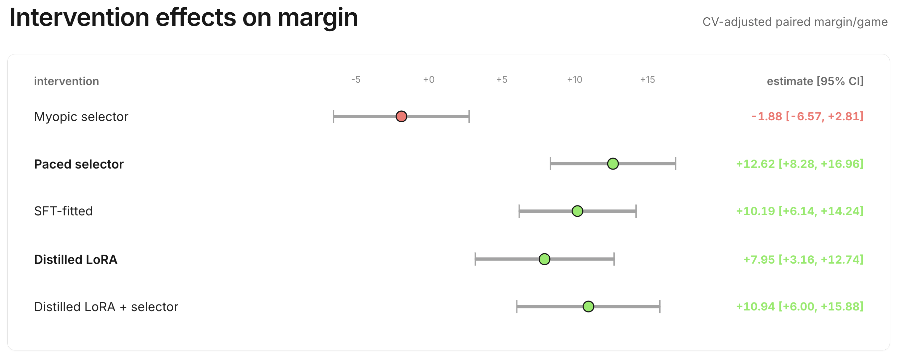

Across separate experiments, adjusted point estimates leave a descriptive 2.99-point gap; the direct within-run selector increment is +3.95 [−0.83, 8.74]. Applying the two measured distillations’ 73–78% retention range to that gap suggests only 2.2–2.3 points from another round, but that estimate should be interpreted purely as an extrapolation. The incremental live interval includes 0, and offline gates find the residual labels only weakly learnable, so another round of expert iteration isn't justified.

## final benchmark

In the 13-model Steiner-triple benchmark, direct comparisons resolve wins over 10 of 12 opponents. Against SFT, Distilled finishes higher in 75% of shared games [58%, 88%], an internal check outside the development evaluations.

To sharpen the ordering of the top three, we evaluate Distilled, Gemini 3.1 Pro, and Gemini 3 Flash together on 150 seeds with all three seat rotations. The resulting 450 games comprise 150 independent deal clusters; the intervals resample the three rotations together.

| pair | fraction A finishes above B | 95% CI | mean score difference |
|---|---:|:---:|---:|
| Distilled vs Gemini 3 Flash | <strong style="color:#00aa00">0.56</strong> | <strong style="color:#00aa00">[0.52, 0.60]</strong> | +5.2 |
| Distilled vs Gemini 3.1 Pro | 0.53 | [0.48, 0.57] | +0.8 |
| Gemini 3.1 Pro vs Gemini 3 Flash | <strong style="color:#00aa00">0.59</strong> | <strong style="color:#00aa00">[0.54, 0.65]</strong> | +4.4 |

The specialist beats Gemini 3 Flash and is statistically unresolved against Gemini 3.1 Pro. Two limitations matter here:

* **Seat effects are heterogeneous.** A later Flash test of the selector’s incremental effect spans 300 paired games across 100 seeds. Its overall effect is +4.32 [0.98, 7.66], but seat 0 is flat while seats 1 and 2 are positive, whereas the earlier test was positive in every seat.
* **Scope of the analytic expert is still narrow.** The selector controls only gated treasure bids and the LLM handles the rest: rejected gates, reveals, loans, and investments. We showed that the gain is internalized, but the LLM isn't necessarily stronger than a complete classical policy.

## conclusions

Across GRPO runs, the two anchored against the SFT checkpoint stayed flat. Several other configurations improve against a fixed scripted heuristic, but they don't record the same transfer measure. This separation is exactly why stationary comparators matter: frozen-SFT anchors, fixed-opponent gates, and non-co-adapting panels answer different questions.

Three quantities matter in each bid. $\hat V$ estimates the asset, $\hat F$ estimates the market, and rollout $Q$ estimates a full continuation against specified policies. The selector combines value and price into a local action.

Regret replay identifies better current-auction purchases within the transitions it holds fixed. Its myopic policy creates a liquidity cascade in live games. Pricing the future use of cash turns an unresolved negative point estimate into a +12.16-point live gain.

The analytic expert also supplies a useful distillation target. Each label shows how a candidate bid changes price paid, win probability, and remaining budget, giving supervised training a decision-level advantage to imitate.

In the runs where transfer is directly tracked, relative outcome rewards did not produce measured transfer across the tested opponent populations. Policy-generated bid logs provide the useful learning signal by exposing price distributions, making liquidity cost explicit, producing distillable targets.
