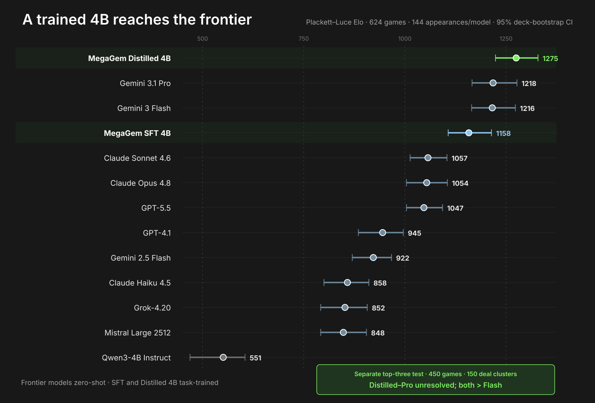
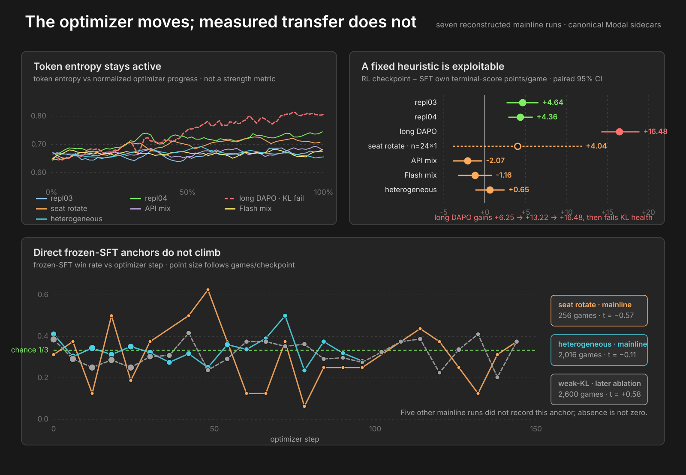
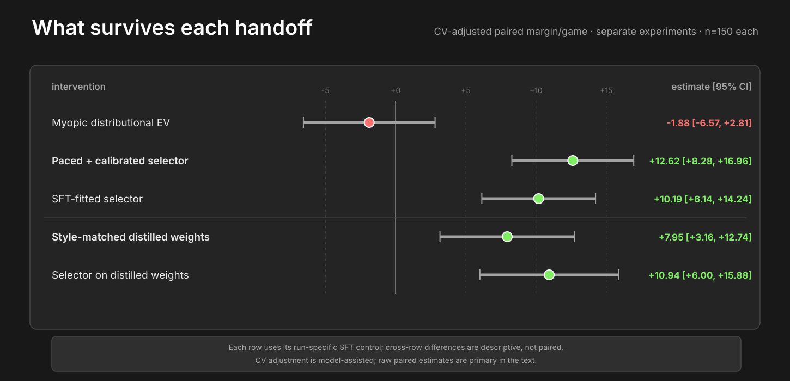

Megagem is a multiplayer, imperfect-information auction game developed by Jane Street. In our three-player, general-sum experiments, self-play opponents and relative outcome rewards produce no measured transferable improvement: some policies learn opponent-specific exploits, while the runs with direct frozen-SFT anchors stay flat. There is no two-player zero-sum minimax target, and symmetric relative-margin rollouts suppress the common value of a favorable deal that a critic might otherwise learn. Policy play becomes useful when we stop treating outcomes as a judge and model bid logs as market data. We begin with Qwen3-4B-Instruct (551 Elo), train it with supervised fine-tuning (SFT), then distill a paced, calibrated distributional bidder through expert iteration. The result is a specialist 4B at 1275 Elo: its standing relative to Gemini 3.1 Pro remains unresolved, while it finishes ahead of Opus 4.8, GPT-5.5, and Gemini 3 Flash in paired same-deck tests.

There is an important qualifier inside that result. The frontier models play Megagem zero-shot; our 4B is trained specifically for it. The comparison says nothing about general capability. It shows how much specialist skill a small model can acquire when the domain is narrow and the learning signal matches the decision problem. The untrained model ranks decisively last. The same architecture becomes competitive after SFT and enters the unresolved top tier after analytic expert iteration.

The question behind that result is why seven mainline policy-gradient configurations produce no measured transferable improvement, while the same policy-generated games ultimately produce a stronger model. Two runs track the frozen SFT policy directly and remain flat; the others expose a different pattern, including large gains against a scripted heuristic that do not establish broader transfer. Answering the question requires separating trajectory outcomes from conditional bid data—and then accounting for the future value of cash.

## understanding megagem

Megagem’s simple instructions belie its complexity in play. Two games provide useful analogies:

* **Figgie:** Jane Street’s first game, designed to simulate open-outcry commodities trading. It is still used to train traders at Jane Street.
* **Splendor:** an engine-building and resource-management game in which gem merchants race to 15 prestige points. It also appears in trading circles because the underlying skills transfer.

Both share with trading the problem of price discovery under uncertainty and information asymmetry. Traders push an asset’s price toward their estimate of fair value while accounting for other participants, news, and information they may not possess. The same ideas appear in simpler form in Megagem.

The rules in brief: three players each start with 35 coins and a secret hand of five gems. Each round, the top auction card is flipped and all three players submit sealed bids simultaneously; the highest bid wins, with ties broken by turn order. The winner takes the auction’s payoff, then reveals one gem from their hand to a public Value Display. A public Value Chart maps that display to everyone’s gem values. Final score is coins left + collection value + mission rewards − loan repayments + investment returns. The game ends when no treasure gems remain to be auctioned, typically after 15–25 rounds.

[TODO: add image here]

Full rules

* goal: obtain the highest final score.
* setup: each of the 3 players starts with 35 coins and a private hand of 5 gems. An auction deck is shuffled, 4 missions are revealed and fixed for the game, and one Value Chart remains public throughout.
* auction types:
  * treasure: bid to add the revealed center gem(s) to your collection.
  * loan: take coins now, repay at the end during scoring. Loans are the only way to bid above your current coins.
  * investment: pay your bid now (coins locked); at scoring, you get the bid back plus the bonus.
* missions: each requires a combination of gems won in auctions. A mission can be claimed only once, by the first player who completes it. The reward is paid out at final scoring.
* each round: flip the top auction card and have everyone submit a sealed bid simultaneously; the highest bid wins, with ties broken by turn order (the winner moves to the back of the line). The winner takes the auction payoff, then reveals one gem from their private hand to the public Value Display.
* value display: a public pool of gems that players reveal from their private hands. At the end, each player reveals their remaining private gems into the display. The terminal display is therefore fixed when the hands are dealt, although players reveal it gradually.
* gem values: each auctioned gem in a player’s collection is worth the amount dictated by the Value Chart, purely as a function of how many gems of that color appear in the Value Display. For example, with Chart A ($1 \to 4, 2 \to 8, 3 \to 12, \cdots, 5+ \to 20$) and 3 red gems in the display, 2 red gems in a player’s collection are worth $2 \cdot 12 = 24$ points.
* game end: the game ends when there are no more gems to auction, typically after 15–25 rounds.
* final score: coins left in hand + collection gem value + mission rewards − loan repayments + investment returns.

## examples

For texture, let’s walk through examples of typical reasoning and how each relates to trading:

[TODO: reuse the assets from above to recreate a game state (ideally from the same game so it's continuous) with Next.js interactions. There should be a few examples here, and the connection to trading should be explained
. a. Understanding the EV of a gem from the moment you see your private hand.
b. factoring in mission value
c. bumping up bid considering tiebreak order
d. deciding which gem to reveal to change public perception
e. bidding optimally to trade/snipe last few auctions (auction poker), some casework
f. loans affecting how much to bid (taking in round order and also desperation based on existing coin count)]

Each case asks the same question: not only what the current lot is worth, but what spending now removes later.

## the option value of a coin

At face value, a coin contributes one point to final score. During the game, it is also worth the best thing you can still do with it: buy the current lot, wait for a better one, fund an investment, or deny a loan. You have the right but not the obligation to spend it, which makes liquidity option-like. This distinction between face value and continuation value becomes central when a locally profitable bidder fails live.

## the environment

Using Prime Intellect's [verifiers](https://github.com/PrimeIntellect-ai/verifiers), we build the [reinforcement-learning (RL) environment](https://app.primeintellect.ai/dashboard/environments/djdumpling/megagem) around three large language model (LLM) clients playing one another. To reduce context cost, a game runs as chained single-turn interactions rather than one persistent multi-turn conversation. On every round, each player receives all information available to that seat—the public state, their private hand, and the public history of the last five auctions. The model returns a structured response; the environment parses the bid, resolves the winner, and prompts that player again if a gem reveal is required. Each game emits a trajectory containing the prompts, responses, parse and legality telemetry, bids, public state, final scores, and the seed needed to reconstruct the deal. The same trajectories support evaluation and self-play rollouts.

Importantly, the environment itself does not define the RL reward. It emits complete game trajectories; a separate offline scorer reconstructs per-turn credit, and the update masks every opponent token so only the trainable seat receives gradients. Keeping the engine, training objective, and benchmark separate avoids making success circular.

## a paired, seat-balanced evaluation

Three-player evaluation creates two different problems: experimental design (which triples play, on which deals, and in which seats) and estimation (deriving scalar Elo and confidence intervals). The benchmark uses three measurements that should not be conflated:

- **Elo**: full-field latent strength determined from three-way rankings, used in the final leaderboard
- **first-place rate**: fraction of games a policy wins (33.3% is average), used in validation panels
- **pairwise finish-above rate**: fraction of shared games in which policy A finishes above policy B, used for model-to-model claims

For balanced Elo estimation, we use a Steiner triple system, which places every pair of models in exactly one triplet. With 13 models, this produces $\frac1{3} \cdot \binom{13}{2} = 26$ triplets. Each triplet plays on 8 seeds, and on each seed the models rotate through all 3 starting hands. The benchmark therefore contains $8 \cdot 3 \cdot 26 = 624$ games, or $624 \cdot \frac{3}{13}=144$ games per model.

Given a strict finish $i\succ j\succ k$ and positive rating $\gamma$, the Plackett-Luce model assigns this ordering probability

$$
P(i\succ j\succ k)
=\frac{\gamma_i}{\gamma_i+\gamma_j+\gamma_k}\cdot
\frac{\gamma_j}{\gamma_j+\gamma_k}.
$$

Fitting Plackett-Luce with majorization–minimization (MM) iteration

[MM iteration](https://projecteuclid.org/journals/annals-of-statistics/volume-32/issue-1/MM-algorithms-for-generalized-Bradley-Terry-models/10.1214/aos/1079120141.full) fits a lightly regularized Plackett-Luce model. The model factors each final ranking into rank selections. In game $g$, let $Z_{g,r}$ be the summed strength of the models still eligible at ranking position $r$; for the ordering above, $Z_{g,1}=\gamma_i+\gamma_j+\gamma_k$ and $Z_{g,2}=\gamma_j+\gamma_k$, the two denominators in $P$. We add 0.1 virtual wins and losses against a strength-1 anchor to stabilize finite samples. Let $W_i = 0.1 + \#\{\text{games in which } i \text{ does not finish last}\}$. Initialize $\gamma_i=1$ and repeat until convergence:

1. recompute every remaining strength $Z_{g,r}$ from the current $\gamma$
2. form each model's *exposure* $D_i = \frac{0.2}{\gamma_i+1} + \sum_{g,r}\frac{\mathbb 1[\,i\text{ remains eligible at rank }r\text{ in }g\,]}{Z_{g,r}}$
3. update $\gamma_i \leftarrow W_i/D_i$
4. rescale the $\gamma_i$ to geometric mean 1

Finally, take $\theta_i = \ln\gamma_i$, center them on the field mean, and convert at the standard $\frac{400}{\ln 10} \approx 173.7$ points per logit. For example, “1275 Elo” is 275 points above the fitted center.

To quantify uncertainty, we bootstrap *matchup-on-deck clusters*, each of which contains the three seat rotations of one triple on one deal. Resampling whole clusters preserves the correlation introduced by a shared deck. We report 95% confidence intervals.

Before trusting any scalar rating, we check whether the field contains cyclic structure, like rock-paper-scissors. The observed cyclic component is indistinguishable from finite-sample noise. No statistically resolved triple forms a directed cycle, and bootstrap rankings are stable.

The tournament transitivity checks

HodgeRank fits one scalar ranking to pairwise log-odds; its weighted residual-to-signal ratio is 0.363. A fitted transitive model averages 0.360 and exceeds 0.363 in 47% of simulations, so the residual is consistent with sampling noise, not evidence of cycles. None of 64 statistically resolved triples forms a directed cycle, and cluster-bootstrap rank order has mean Spearman correlation 0.964.

To compare two models A and B directly, we use the simpler finish-above rate: among games containing both models on the same deal, how often does A finish above B? This paired statistic removes much more deck variance than comparing two marginal Elo intervals.

## data and SFT

The base Qwen3-4B-Instruct is sufficiently coherent to parse but strategically awful. On a six-opponent validation panel, it wins 5 of 180 games and finishes an average of 62 points behind the mean of its two opponents. It spends almost all its coins, completes few missions, and hallucinates a gem outside its private hand on roughly 2–5% of reveal turns.

| teacher | full-field mean score | self-play mean score | visible rationale length |
|---|---:|---:|---:|
| Gemini 3 Pro | 82.5 | 68.7 (-14.3) | 207 words |
| Gemini 3 Flash | 80.4 | 69.4 (-11.0) | 230 words |
| Claude Opus 4.5 | 77.3 | 73.1 (-4.2) | 327 words |
| Claude Opus 4.6 | — | — | ≈421 words |

We choose the teachers on two criteria:

- **skill:** The initial screen, run before the final Elo ranking, compares Gemini 3 Pro, Gemini 3 Flash, and Claude Opus 4.5. A full-field score can conflate strategic skill with exploiting weaker opponents, so we also run a 24-game-per-model probe with three copies of each model. Opus 4.5’s mean falls the least, from 77.3 to 73.1, and it finishes above the Gemini variants. Clone-game scores also reflect how a policy changes total surplus, so this remains a screening signal rather than a clean strength estimate.
- **length and cost:** In that probe, Gemini 3 Pro, Gemini 3 Flash, and Claude Opus 4.5 average 207, 230, and 327 visible words per response. Flash is about fourteen times cheaper per game than Opus. A blend supplies enough long rationales to diversify the data without making every game Opus-priced.

For production collection, we keep Flash and replace the screened Opus 4.5 with its newer 4.6 successor; that substitution is family-informed rather than a direct result of the screen above. The final corpus uses 70% Flash and 30% Opus 4.6. Opus 4.6 averages about 421 visible words, estimated from 561 billed tokens, while the resulting corpus averages about 324 tokens under the student tokenizer. The table and those corpus statistics therefore use different units.

### defining the dataset

We generate 150 training games and 10 validation games, one game per seed, yielding approximately 9,000 traces. Keeping only the winner’s traces would waste data and select the luckiest copy of an otherwise identical policy. It would also remove the coin-poor and slower-tempo states that Qwen3-4B-Instruct needs to handle. Instead, each game contributes turns from its top two finishers. We remove unparseable or illegal turns; only 10 training turns fail those validity gates. The final split contains:

| split | teacher games | examples | bid turns | reveal turns |
|---|---:|---:|---:|---:|
| train | 150 | **6,153** | 4,990 | 1,163 |
| validation | 10 | **420** | 342 | 78 |

Training uses a LoRA with rank 32, alpha 64, and dropout 0.05, applied to the attention and MLP projections. Sequence length is 4,096; effective batch size is 16; the learning rate is $2\times10^{-4}$ with cosine decay and 50 warmup steps. We train for 1,200 optimizer steps, or roughly three epochs, save an adapter every 200 steps, merge the adapters from steps 1,000 and 1,200 into separate base checkpoints, and evaluate both through the same vLLM stack.

[TODO: add image of SFT and val loss]

Checkpoint selection uses the 10 validation seeds and a panel comprising Gemini 3 Flash, Claude Opus 4.6, Claude Sonnet 4.5, Llama 4 Maverick, Intellect-3, and GPT-OSS-120B. Qwen faces two copies of each named opponent and occupies all three seats on each of 10 deals, for $6\times10\times3=180$ panel games, plus 10 self-play games.

| checkpoint | panel first-place rate | vs two Opus 4.6 copies | parseable | illegal reveal | self-play mean score |
|---|---:|---:|---:|---:|---:|
| base Instruct | 2.8% | 0.0% | 99.6% | 5.3% | 59.77 |
| SFT step 1,000 | 61.7% | 16.7% | 100% | 0.9% | 64.27 |
| SFT step 1,200 | **64.7%** | **50.0%** | 100% | 0% | 61.63 |

We select step 1,200 because it is fully legal and performs better across the frozen panel—crucially, against Opus 4.6—rather than merely widening an already decisive edge over easier opponents. The three-copy self-play mean is only a sanity check: when every seat changes together, total score cannot show whether one checkpoint is stronger than another against a fixed opponent.

SFT gives us a strong frozen anchor. Self-play now gets the harder test: can it improve against policies that do not change with it?

## self-play moves, but does not transfer

Across a reconstructed audit set of seven mainline Group Relative Policy Optimization (GRPO) configurations, we find no resolved transferable improvement. The two runs with direct frozen-SFT tracking remain flat. Several others do learn a scripted-heuristic exploit, so the null is not simply “training does nothing.”

In each run, one seat is trainable while the other two come from some mixture of frozen SFT, lagged snapshots, a scripted heuristic, and external models. For each seed, seat assignment, and opponent table, the trainable policy plays the same deal $K=8$ times with different sampled responses. Each fresh rollout batch supports six optimizer steps, so these are amortized-refresh GRPO experiments rather than a new on-policy rollout at every update.

### measuring transfer

Because first-place rate among three evolving, co-adapting copies remains approximately $\frac1{3}$ whether the population improves or merely changes together, training-population reward is not a sufficient progress measure. Performance against the frozen initial SFT policy is the anchor.

The evidence uses two instruments, which should not be conflated:

- The scripted-heuristic gate compares a GRPO checkpoint with frozen SFT on matched deals. It detects whether training finds that opponent’s weakness.
- The frozen-SFT anchor measures the learner throughout training against the unchanged step-0 policy. Only two mainline runs record this stationary anchor.

| GRPO configuration | scripted-heuristic Δ own score vs SFT [95% CI] | frozen-SFT anchor | optimizer health |
|---|---:|---:|---:|
| snapshot replication | +4.64 [2.68, 6.57] | not measured | pass |
| no-API replication | +4.36 [2.89, 5.88] | not measured | pass |
| long DAPO | +16.48 [14.26, 18.93] | not measured | **fail: max KL 0.646** |
| seat rotation | +4.04 [−3.88, 11.88] | $t=-0.57$, 256 games | pass |
| API mix | −2.07 [−3.89, −0.31] | not measured | pass |
| Flash mix | −1.16 [−3.22, 0.89] | not measured | pass |
| heterogeneous pool | +0.65 [−1.14, 2.43] | $t=-0.11$, 2,016 games | pass |

The heuristic contrasts use 60 matched seed groups with eight samples each, except the 24-game seat-rotation diagnostic. In the long run, the own-score advantage over SFT grows from +6.25 at step 100 to +13.22 at 200 and +16.48 at 400, even as the run fails its KL health gate. The optimizer can learn a narrow exploit.

The larger direct anchor remains flat across 17 checkpoints and 2,016 underlying games: mean checkpoint first-place rate is 0.329 in the first half and 0.339 in the second, with trend $t=-0.11$ across checkpoints. The smaller 22-checkpoint anchor moves from 0.330 to 0.278, with $t=-0.57$. A later eighth ablation reduces the KL coefficient tenfold; its 25-checkpoint trend is still unresolved at $t=+0.58$ over 2,600 underlying games, and its heuristic contrast is +0.75 [−0.84, 2.36]. None of these results rules out a richer league design. They do show that more opponent mixing and weaker KL do not repair transfer here.

### what GRPO optimizes

For player $i$, playing against $j$ and $k$, define competitive margin as $m_i=s_i-\frac{s_j+s_k}{2}$. The terminal reward is

$$
R_i^{\text{terminal}}
=\tanh\left(\frac{m_i}{19.6}\right)+0.1\mathbf 1[i\text{ wins}]
$$

We calibrate the scale 19.6 so the historical median absolute margin, 10.75 points, maps to 0.5 through $\tanh\left(\frac{10.75}{19.6}\right) \approx 0.5$. Because $\tanh(x)\in(-1,1)$, this compresses extreme wins and losses while preserving their order. A shaping channel, weighted by 0.01, assigns intermediate credit from reconstructed public-score changes between rounds; a terminal correction aligns its cumulative accounting with the final margin. Illegal actions receive $-0.5$.

Let $r_u$ denote the terminal, legality, or shaping reward assigned at turn $u$. For each trainable turn $q$, define the return-to-go $G_q=\sum_{u\ge q}r_u$ and subtract an exponential-moving-average baseline $b_q$ indexed by game phase and seat role. Let $\mathcal G$ contain all trainable turns from the eight sibling games. The standardized advantage is

$$
A_q=\frac{(G_q-b_q)-
\operatorname{mean}_{v\in\mathcal G}(G_v-b_v)}
{\operatorname{std}_{v\in\mathcal G}(G_v-b_v)}
$$

This quantity asks which turns have better remaining returns than comparable turns in the same-deal group. Only turns from the trainable seat receive gradients.

### verifying optimizer health

We sample at temperature 1.0 and top-$p=0.95$, then update a rank-32 LoRA with learning rate $10^{-5}$ and KL coefficient 0.01, which penalizes drift from the SFT reference.

The heterogeneous run completes 100 optimizer steps with 192 games per rollout generation and no degenerate eight-game groups, where all sibling returns are identical and yield no learning signal. Averaged across rollout generations, advantage and terminal margin have Spearman correlation 0.902. Divergence from the SFT reference is small but nonzero. Training contains 5 parse failures among 66,649 rows, while its final evaluation contains no illegal RL actions across 480 games. Format failures are negligible, not absent. Together, these checks make a dead adapter, broken reward ordering, or format collapse poor explanations for the frozen-anchor null.

| diagnostic | heterogeneous run |
|---|---:|
| learning rate | $10^{-5}$  |
| mean KL from reference | 0.0037 |
| maximum KL | 0.0061 |
| mean PPO ratio clip fraction | 0.0012 |
| advantage variance | 0.81 |
| zero-standard-deviation groups | 0 |
| advantage↔terminal-margin Spearman | 0.902 |
| training parse failures | 5 / 66,649 |
| final-eval illegal actions | 0 / 480 |
| anchor games | 2,016 |

## why self-play reward is not a portable judge

The optimizer is active, and several policies learn to beat their training opponent. The remaining question is when “better against my current population” implies “better at the game.”

### two players, zero-sum (2p0s)

In chess, Go, and heads-up poker, one player’s gain is the other’s loss. That opposition gives the game an opponent-independent target: choose the strategy whose worst case is best.

Under pure opposition (the opponent’s goal is to make you lose), you have to assume the opponent plays whatever hurts you most. You then choose the strategy with the best worst case, the maximin; your opponent does the opposite, minimizing the maximum you can extract, the minimax. Von Neumann’s minimax theorem says these are equal.

The minimax theorem, formally

Consider a payoff matrix $A$ where, if you play row $i$ and your opponent plays column $j$, you receive $A_{i,j}$ and your opponent receives $-A_{i,j}$. With mixed strategies over your actions $\mathbf{X}$ and your opponent’s $\mathbf{Y}$,

$$
\max_{x \in \mathbf{X}} \min_{y \in \mathbf{Y}} x^\top \mathbf{A} y
=
\min_{y \in \mathbf{Y}} \max_{x \in \mathbf{X}} x^\top \mathbf{A} y.
$$

Mixed strategies matter because pure best responses can cycle. In rock-paper-scissors, every pure action is immediately exploitable, while the uniform mixture is not. The theorem lives over distributions precisely so that the strategy space is convex and the opponent cannot exploit a deterministic pattern.

If neither player can improve by unilaterally deviating, the joint policy is in Nash equilibrium; in a two-player zero-sum game, its equilibrium strategies are also minimax. This gives a clean progress measure: exploitability, or how much a worst-case opponent could gain by deviating. Ordinary policy-gradient self-play is not guaranteed to converge—even simple games can cycle—but the game still supplies a meaningful certificate. A fall in exploitability means the strategy is becoming harder for *any* opponent to exploit.

Historical snapshots, exploiters, and matchmaking can keep the latest policy from forgetting old weaknesses. They broaden the population but do not, by themselves, create an opponent-independent target.

### more than two players and general-sum

Megagem has three players, and its score changes are not constrained to sum to zero. Buying a loan to starve one opponent may mainly help the third. A losing player can decide which leader wins. Two players can pressure the leader without sharing a formal team reward. There is no single minimax value that plays the same role.

A single optimal bid also breaks down because best play is contingent on opponents. Against a player who always bids 0, bidding 1 wins cheaply; against a rational player, the same bid loses. If a kingmaking action barely changes the acting player’s own reward, a policy-gradient update has almost no direct signal for whether helping one rival rather than another matters strategically to the table.

We can still measure deviation gains around a specified joint policy, but there is no unique opponent-independent strategy to measure distance from. Self-play can work outside two-player zero-sum games; the word “improvement” must name an opponent distribution, equilibrium-selection rule, or population game. A self-play reward curve is otherwise indexed to its training population.

### chance, imperfect information, and endogenous values

Three other properties make the learning signal noisier. First, deals are stochastic: a good hand can raise score without reflecting a better decision. Second, the game has imperfect information. A player acts not on the hidden state itself, but on an information state—their private hand plus the public history—and an implicit belief over worlds consistent with it. A value function remains well-defined over that information state, but a critic trained from a lossy current-state observation can conflate histories that imply different beliefs.

Because bids are simultaneous, choosing an action requires a distribution over clearing prices: for bid $b$, what is $P(\text{win}\mid b)$? The selector later uses that distribution to compute expected utility. Every bid trades the surplus retained after paying against the probability of winning.

Third, the final gem values are fixed by the initial deal but revealed endogenously through play. Reveals do not change the terminal display; they change what every player believes before later auctions. For the common-value component of a lot, winning carries information of its own: if both opponents decline to pay your price, you may have overvalued it. Private mission value weakens that winner’s-curse intuition because the same lot can rationally be worth different amounts to different seats. The deployed system handles the practical pieces separately: a calibration term corrects systematic value bias, while a price distribution represents uncertainty about what opponents will pay.

## repairing the outcome signal

Population dependence explains why training wins may not transfer. A second problem is assigning those wins to individual decisions.

### why trajectory-level credit is a poor fit

GRPO is an understandable engineering choice but a questionable statistical fit. It avoids training a separate critic, yet this setup is far from the typical single-turn GRPO task. A game lasts roughly 15–25 rounds of interleaved bids, reveals, loans, and investments. Most reward arrives at the end, so an early bid and a late reveal can inherit nearly the same verdict even though either may have changed every state that follows. The same-deal comparison removes hand luck, but it does not identify which action within a sampled trajectory earns the final margin.

We do not claim that GRPO cannot work on long-horizon or multi-turn tasks. Dense verifiable rewards, process supervision, much larger groups, or environments in which one decision dominates the outcome can still make trajectory-level comparison useful.

### why a state-value critic is the wrong repair

We next ask whether a value function can recover the missing signal. For each fixed board $b$, let $\bar Y_b$ and $s_b^2$ be the sample mean and within-board variance of its rollout returns. Because the observed variance of board means includes finite-sample noise, we estimate the true between-board variance as

$$
\hat\sigma^2_{\text{board}}
=\max\left(0,
\operatorname{Var}_b(\bar Y_b)-\frac{\mathbb E_b[s_b^2]}{K}
\right)
$$

with within-board variance $\hat\sigma^2_{\text{trajectory}}=\mathbb E_b[s_b^2]$. In the probe, 99.8% of the estimated variance lies among trajectories from the same board, while only 0.2% lies between corrected board means. The within-board term contains both action effects and continuation noise; it is not a clean action signal. A state-value critic must learn the much smaller between-board component from labels dominated by within-board variation.

Megagem positions certainly have value. This relative-margin self-play setup, however, removes most common board advantage because all three copies benefit from the same favorable deal. Board effects reappear when the probe uses a fixed, strategically different heuristic, because repeated outcomes then reflect the position’s value rather than only the variation injected by near-identical policies.

The probe argues against learning $V(I)$ from these particular relative-margin labels; it does not rule out state values in general. An action-conditioned value $Q(I,a)$ could still distinguish bids within the same state, motivating the next branches.

### piKL-style rollout-$Q$ distillation

The first plausible fix is a [piKL](https://arxiv.org/abs/2210.05492)-style target, inspired by Meta’s work on Diplomacy, a seven-player game outside the two-player zero-sum setting. It builds a search distribution that favors bids with higher action value $Q(I,a)$ while paying a KL penalty for moving too far from the SFT policy. Here, $Q(I,a)$ means the expected outcome after taking bid $a$ from information state $I$ and playing the game to completion.

We estimate $Q$ by simulation. The acting player cannot see the opponents’ hands or the undealt deck order, so we sample several *worlds* $w$: complete assignments of the hidden information that remain consistent with the player’s hand and the public history. In each world, we force candidate bid $a$, let the SFT continuation policy $\pi$ finish the game in the acting seat while policy $\omega$ controls the opponents, and read off the terminal score margin:

$$
Q_{\pi,\omega}(I,a)=\mathbb E_{w,\,\xi}\left[\tanh\!\left(\frac{m_{\text{terminal}}}{19.6}\right)\right].
$$

Here, $\xi$ is the stochastic continuation generated by $\pi$ and $\omega$. We score every candidate on matched sampled worlds and random seeds, which reduces comparison noise without eliminating it. More importantly, $Q$ still depends on $\omega$: changing the continuation opponent can reorder bids even when $(I,a)$ stays fixed.

piKL combines these action values with sampled action frequencies $\hat\tau$ from the SFT policy, upweighting high-$Q$ bids while remaining anchored to that distribution:

$$
\pi_{\text{piKL}}(a\mid I)\;\propto\;\hat\tau(a\mid I)\,\exp\!\left(\frac{Q(I,a)}{\lambda_{\mathrm{KL}}}\right).
$$

The temperature $\lambda_{\mathrm{KL}}$ controls the strength of the anchor. As $\lambda_{\mathrm{KL}}\to\infty$, the $Q$ tilt vanishes and the distribution returns to the SFT frequencies $\hat\tau$; as $\lambda_{\mathrm{KL}}\to0$, it concentrates on the sampled candidate with the largest $Q(I,a)$. The $\lambda_{\mathrm{KL}}=0$ arm in the table implements that limiting argmax directly.

We label decisions with this $Q$, build piKL targets at several $\lambda_{\mathrm{KL}}$ values, and distill them with LoRA SFT. Each candidate then occupies every seat against two frozen SFT copies over the same 120 games, 40 per seat.

| $\lambda_{\mathrm{KL}}$ | first-place rate | mean margin [95% CI] | paired Δ margin vs $\lambda=\infty$ [95% CI] |
|---:|---:|---:|---:|
| $\infty$ | 0.425 | +1.23 [−2.21, 4.68] | — |
| 1 | 0.417 | +2.73 [−1.06, 6.51] | +1.49 [−3.37, 6.35] |
| 0.3 | 0.317 | −1.38 [−4.72, 1.95] | −2.62 [−7.12, 1.89] |
| 0.1 | 0.292 | −1.79 [−5.06, 1.48] | −3.02 [−7.55, 1.51] |
| 0 | 0.350 | −0.25 [−3.64, 3.13] | −1.49 [−6.37, 3.40] |

Mean-margin arm intervals use the normal approximation; paired intervals use a $t$ interval over matched games.

Giving self-play $Q$ more influence produces no resolved improvement. First-place rate generally falls, mean margin is not monotone, and every paired interval includes zero. The no-$Q$ self-distillation control remains competitive with every search-derived target.

A small held-out probe supports one explanation. At 40 bid nodes with up to six candidates each, changing only the continuation opponent from self-play to base Qwen reduces median action-rank correlation with the self-play ordering from 1.0 to 0.43, while top-action agreement falls from 100% to 27.5%. The sign of each candidate’s advantage over the reference bid still agrees 72.5% of the time. The probe is too small, and the alternative opponent too weak, to establish the mechanism by itself. It does show that fine $Q$ rankings can depend strongly on the continuation policy.

A second five-arm sweep replaces the self-play continuation with Gemini 3 Flash. Relative to its $\lambda=\infty$ control, the $\lambda=1$ and argmax contrasts are +6.10 [0.38, 11.82] and +5.81 [0.70, 10.93]. These comparisons are exploratory, uncorrected for multiplicity, and unreplicated. We do not promote an arm without multiplicity correction or replication.

On a separate 43-node offline proxy, aggregating $Q$ over five fixed continuation types also never beats the single-self-play-$Q$ baseline. This is diagnostic evidence, not a live policy comparison.

## testing whether an action critic can support PPO

GRPO’s group return cannot identify which bid changes the outcome. PPO could instead update from an action-specific advantage supplied by a learned critic. Before paying for an actor update, we test whether such a critic can rank candidate bids reliably enough to be useful.

### defining a centralized action critic

The actor commits to a bid from information state $I$ before the opponents’ simultaneous bids are known. Once the auction resolves, those bids become public. During training, a critic can use this newly revealed information even though the actor never receives it at inference—a setup often called centralized training with decentralized execution. Holding the observed opponent bids $\mathbf b_{-i}^{\mathrm{obs}}$ fixed asks a narrow counterfactual: what happens if only our bid changes?

$$
Q^{\mathrm{obs}}_{\pi,\omega}(I,a)
=Q_{\pi,\omega}\!\left(
I,a\mid\mathbf b_{-i}=\mathbf b_{-i}^{\mathrm{obs}}
\right)
$$

Most raw $Q$ variation reflects whether the state itself is favorable. To isolate differences among bids, we center each target over the retained candidate set $C(I)$:

$$
\widetilde Q_C(I,a)=Q^{\mathrm{obs}}_{\pi,\omega}(I,a)
-\frac{1}{|C(I)|}\sum_{a'\in C(I)}
Q^{\mathrm{obs}}_{\pi,\omega}(I,a')
$$

This is an unweighted, candidate-centered ranking target, not yet the policy-weighted advantage used in a PPO update.

### generating labels

At each treasure-bid state reached by the actor, we sample $K=16$ bids and compress them to 6 diverse candidates. The selection retains the played bid while approximately preserving both the policy’s sampled mass and the numerical range of bids. We score every candidate on the same sampled worlds and random seeds, and hold the opponents’ observed bids fixed. This paired design reduces comparison noise. After the forced bid, a deterministic frozen SFT policy completes the game, so the labels estimate value under that continuation policy—not under a future, updated PPO actor.

### calibrating the worlds

For 32 games, we evaluate each candidate with $M=64$ hidden-world samples, yielding 379 bid states and 1,462 candidate rows. Because smaller estimates reuse prefixes of the same 64 worlds, we can compare 4, 8, 16, or 32 worlds with the 64-world reference without further rollouts. “Pair-sign agreement” measures whether actions separated by a $Q$ gap of at least 0.05 and 95% paired sign confidence retain their ordering; regret measures how much reference $Q$ is lost by selecting the lower-sample-budget argmax.

| worlds | pair-sign agreement with $M=64$ | mean regret vs $M=64$ | 90th-percentile regret vs $M=64$ | all-state argmax agreement |
|---:|---:|---:|---:|---:|
| 16 | 95.45% | 0.0207 | 0.0770 | 55.3% |
| 32 | **99.77%** | **0.0105** | **0.0370** | 71.1% |
| 64 | 100% | 0 | 0 | 100% |

At $M=32$, confidently separated pairs agree with the 64-world reference 99.77% of the time. Exact argmax agreement is only 71.1%, because close top candidates can still swap. Since the later training set retains confidently separated pairs, we adopt 32 worlds at half the rollout cost.

### is the action signal learnable?

Across all 379 calibration states, the mean spread from worst to best retained action is 0.2149 in $\tanh$-margin utility, and the estimated best action improves 0.0931 over the SFT-weighted candidate mean. That second number is an in-sample rollout-oracle bound, not realizable policy uplift. The average gap between the top two is only 0.0599, and the SFT policy’s played action is already best 36.1% of the time.

Most candidate-$Q$ variation is irrelevant to choosing a bid: 84.8% lies between states, while only 15.2% separates actions within a state. The earlier 99.8% figure measures raw whole-trajectory variation across replicas grouped by initial deal; this split measures paired rollout-$Q$ estimates grouped by decision state. They describe different levels of the experiment. PPO can use only the within-state component, because a state-wide offset raises or lowers every candidate together.

Before training another 4B network, we ask whether any model can recover that minority signal from the available rows. Across four split seeds, four-fold whole-game cross-validation fits small structured models to multi-action states from the $M=64$ reference labels. The table reports ranges across split seeds; “uplift” is offline $Q$ improvement over the SFT candidate mixture, not live game margin.

Each row is a gradient-boosted tree fitted to the candidate-$Q$ labels. The centralized model receives the observed opponent bids, while the actor-visible model does not. Two negative controls either shuffle the targets or drop the candidate bid, leaving a model that can predict only common state value. “Filtered pair accuracy” scores only the confidently separated action pairs defined above.

| model | filtered pair accuracy | full-set argmax | mean $Q$ uplift vs SFT |
|---|---:|---:|---:|
| centralized context | **74.8–75.9%** | 33.4–35.9% | +0.0268 to +0.0315 |
| actor-visible state only | 72.3–74.6% | 32.2–35.6% | +0.0272 to +0.0314 |
| shuffled-target control | 44.3–51.9% | 23.8–29.4% | −0.0309 to −0.0062 |
| no-action control | all ties | 23.2% | −0.0680 |

The action signal is detectable offline: both real models have positive mean uplift across all split seeds, while both controls are nonpositive. But the privileged opponent-bid context offers no stable advantage over actor-visible features, and even the best structured model selects the exact top candidate only about a third of the time.

### the neural critic fails

Reusing the same confidence gates from calibration (gap $\ge0.05$, 95% sign confidence, at most six pairs per state), we train a 4B critic from the SFT checkpoint. A confidence-weighted Bradley–Terry loss—a pairwise ranking objective—teaches it to rank the better bid above the worse one; a Huber term, a robust regression loss, also trains the numeric centered value at weight 0.25. Each one-epoch run uses 543 training pairs, 210 validation pairs, and a learning rate of $10^{-5}$.

| critic | filtered pair accuracy | full-set argmax (75 groups) | mean grouped regret | $R^2$ on centered advantage |
|---|---:|---:|---:|---:|
| non-leaky linear-bid baseline | — | **40.0%** | — | — |
| 1 epoch, seed 0 | 62.9% | 24.0% | **0.0989** | −2.31 |
| 1 epoch, seed 1 | 59.5% | 25.3% | 0.1096 | −107.54 |
| 1 epoch, seed 2 | 64.8% | **34.7%** | 0.1051 | −17.64 |
| 3 epochs, seed 0 | **66.2%** | 25.3% | 0.1011 | −16.56 |

Among the three one-epoch seeds, all exceed chance and two exceed 60% filtered pair accuracy. But that metric excludes close comparisons, making the task easier; exact argmax has the opposite weakness, penalizing harmless swaps among nearly tied bids. Even under the preregistered gates, every neural run misses the 55% argmax threshold and the 40% linear-bid baseline. Training the seed-0 model three times longer improves filtered pair accuracy while argmax remains at 25.3% and numeric calibration worsens. The critic learns coarse ordering without a reliable action-value surface.

### why we stop before PPO

More data or a different critic architecture could improve the policy-facing metrics, but the pilot provides no evidence of a favorable scaling curve.

The next meaningful rung—128 games and roughly 1,485 decision states—costs an estimated 328 H200-hours, with $\pm40\%$ uncertainty. Reaching 1,024 games and then evaluating on the sequestered 128-game final test approaches 3,000 H200-hours.

PPO could in principle improve beyond a fixed expert, but it must first compress expensive rollouts into small critic differences and then refresh them as the actor’s state distribution moves. The analytic route instead produces explicit bids from $\hat V$ and $\hat F$ and trains them with ordinary cross-entropy; it already passes a live weights-only gate. Given that evidence, the critic needs a much stronger diagnostic result to justify more compute.

We therefore stop after the critic diagnostics: no production label corpus and no actor update. The labeler, critic trainer, diagnostics, and actor bridge remain as a bounded research direction.

## distributional price modeling: from outcomes to market data

### why a point estimate is not enough

One final search variant keeps the terminal rollouts but replaces the opponents’ current bids with deterministic predictions from a fitted market model. The best arm changes paired margin by only +0.58 [−5.6, +6.8], an unresolved result.

A separate diagnostic asks whether a much better point predictor would solve the problem. A gradient-boosted tree trained on 3,174 logged Gemini 3 Flash bids reaches an out-of-fold mean absolute error (MAE) of 1.10 coins with essentially zero bias. Yet it still predicts the wrong side of the actual win/loss threshold on 26.1% of auctions. Fifty-five percent of auctions resolve within one coin, where Flash’s own sampling noise straddles the boundary even when the conditional mean is accurate. The remaining error is dispersion around the predicted bid, not a mean offset that a better point estimate can remove.

This narrows the next step: model the full bid distribution rather than a single predicted opponent bid.

### treating bids as market observations

The central reframe is simple. A corpus of policy-generated games contains two kinds of information:

1. a few terminal outcomes—one final margin per player—each noisily supervising a long sequence of actions against particular opponents;
2. thousands of local market observations of the form “given this public state, this policy bids $b$.”

GRPO uses the first at trajectory level, while the action critic tries to refine it to individual decisions. We instead model the second as a conditional price law $\hat F$. This does not solve the full multiplayer game; it makes one sealed-bid auction tractable. Given an estimated lot value and a distribution over opponent bids, we can score every legal bid by expected surplus.

A point model treats one predicted opponent bid as certain. A distribution instead asks what fraction of the predicted bid mass each candidate beats:

$$
U_{\hat F}(b)=(\hat V-b)\hat P_{\hat F}(\text{win}\mid b).
$$

Prediction error now moves probability mass rather than flipping an imagined deterministic outcome. We develop the first version on Gemini 3 Flash logs, then test whether the same price law can be learned from the SFT policy’s own bids.

### constructing the value distribution

The acting player knows three useful quantities for color $c$:

* $\text{display}_c$: how many gems of that color are already public
* $\text{own hand}_c$: how many of that color remain in their own private hand
* $\text{collection}_c$: how many have been removed into public collections

There are six gems of each color in the game. Because the player’s remaining hand eventually enters the display, a live lower bound on the final count is $L_c=\text{display}_c+\text{own-hand}_c$. Collected gems never enter the display, so an upper bound is $U_c=6-\text{collection}_c$. An 11-feature classifier uses these bounds, reveal progress, and round number to predict the final count $n_c$, one of 7 values from 0 through 6. It never sees opponents’ hidden hands. The prediction also remains independent of the Value Chart until inference, when we convert the count distribution to points.

Every logged game produces one supervised row per round, acting seat, and color. We split games 70% for fitting, 10% for calibration, and 20% for held-out testing. The value model is a rectified-linear-unit multilayer perceptron (ReLU MLP), $\mathbb{R}^{11} \to \mathbb{R}^{64} \to \mathbb{R}^{32} \to \mathbb{R}^{7}$. With an $L_2$ coefficient of $10^{-3}$, it trains for at most 300 iterations, with patience of 10 and `tol=1e-4`.

For a lot with colors $g_1,\ldots,g_r$, the head outputs the seven-way count distribution $\hat P(n_{g_i}=k\mid I)$. We map that distribution through the active chart to get each gem’s raw expected value, then apply an isotonic calibration map $f$ before summing the gems. This flexible one-dimensional correction curve can fix systematic bias without ever mapping a higher raw value to a lower calibrated one:

$$
\hat V_{\text{lot}}
= \sum_{i=1}^r f\!\left(\sum_{k=0}^{6}
\hat P(n_{g_i}=k\mid I)\operatorname{Chart}(k)\right)
+ \operatorname{MissionBonus}(\text{collection},\text{lot}).
$$

Here $\operatorname{Chart}(k)$ is the eventual **per-gem** value when $k$ gems of that color appear in the final display; the mission term is exact rather than learned. Thus $\hat P$ is the classifier output, while $\hat V_{\text{lot}}$ is the calibrated value supplied to the selector.

### constructing the bid distribution

A histogram gradient-boosted regressor predicts each opponent seat’s conditional mean bid $\hat\mu_s(x)$ from 16 public, bid-time features, including coin count, lot size and displayed value, recent clearing prices, and tiebreak position. The frozen model uses 400 boosting iterations, learning rate 0.05, depth 4, and $L_2$ regularization 1.0. We group five-fold cross-validation by paired seed so near-duplicate treatment and control games cannot enter opposite folds. This production mean model is fitted on 3,642 Gemini 3 Flash bid rows, rather than the 3,174-row diagnostic above. Its grouped out-of-fold MAE is 1.230 coins with bias +0.013, and 69.4% of predictions land within one coin.

A point model would stop there. Instead, let $B_s$ be opponent seat $s$’s actual bid in the current auction. We retain every out-of-fold residual $\epsilon=B_s-\operatorname{round}(\hat\mu_s(x))$ and pool them into an empirical noise distribution. At inference, we shift those historical errors by the current predicted mean, round to integers, and clamp to the opponent’s legal budget. With $N$ stored residuals and current budget $c_s$,

$$
\hat P(B_s=z\mid x)=\frac{1}{N}\sum_{r=1}^N\mathbf 1\left[z=\operatorname{clip}\big(\operatorname{round}(\hat\mu_s(x)+\epsilon_r),0,c_s\big)\right]
.
$$

For clarity, suppose the current mean prediction is 8 and the residual law puts 20% of its mass at −1, 50% at 0, and 30% at +1. The implied opponent bids are 7, 8, and 9 with probabilities 0.2, 0.5, and 0.3. Bidding 9 is no longer treated as a certain win: it beats 70% of that distribution and wins or loses the 30% tie mass according to public tiebreak order.

With exact tiebreak handling, the probability that candidate bid $b$ beats opponent $s$’s unknown bid $B_s$ is

$$
p_s(b)=\hat P(B_s<b)+\mathbf 1[\text{wins tiebreak}]\hat P(B_s=b).
$$

Assuming the opponents’ remaining bid variation is conditionally independent, the probability of beating both factors as

$$
\hat P(\text{win}\mid b,x)=\prod_{s\ne i}p_s(b).
$$

This independence assumption is approximate. The public features already capture many shared causes of bidding, leaving the residual variation specific to each opponent. Modeling the full joint conditional distribution $P(B_1,B_2\mid x)$ would require substantially more data because the possible bid pairs form a much sparser outcome space.

### what logged auctions can prove

We collect 164 logged games in 82 seed clusters; games sharing a deal stay in the same cluster. Seat 0 plays the SFT policy against two Gemini 3 Flash opponents. The games yield 1,821 seat-0 treasure decisions and 3,642 opponent-bid rows, two per decision. For each seat-0 decision, the final display reveals the treasure lot’s realized value $V$. Let $p$ be the highest recorded opponent bid. The ideal clearing-price surplus is $S^*=\max(0,V-p)$. For a counterfactual bid $b$, we resolve the auction against the *actual* logged opponent bids, giving realized surplus $S(b)=(V-b)\mathbf 1[b\text{ wins}]$. Decision regret is

$$
R(b)=S^*-S(b).
$$

$R(b)$ captures two forms of decision regret:

* **Overpaying:** when a bid wins, regret is the surplus forfeited by paying above the cheapest winning price.
* **Passing:** when a bid loses a profitable lot, $R(b)=S^*$ is the surplus left on the table.

Zero regret can be unattainable when the budget cannot beat a profitable clearing price, or when $V>p$ but losing the tiebreak makes the cheapest winning bid $p+1$ rather than $p$. Even the best legal realized-price oracle can therefore have positive regret. The comparison is exact for the current sealed-bid auction conditional on the logged opponent bids, but it is not a full-policy off-policy evaluation: it holds the future state and opponent adaptation fixed.

To isolate the price model, every counterfactual bidder receives realized terminal gem value $V$ and no mission bonus. The live selector later replaces that privileged value with $\hat V$ plus exact mission value.

| bidder | regret (coins/decision) | improvement vs SFT |
|---|---:|---:|
| SFT checkpoint | 4.124 | — |
| best fixed shading of true value, no price model | 3.356 | +0.768 |
| fitted mean + point prediction | 3.275 | +0.848 |
| fitted mean + residual distribution | **2.819** | **+1.304** |
| best legal bid with realized prices | 2.118 | +2.006 |

We compute regret differences within each seed cluster and use those cluster means to form the $t$ statistic. The clairvoyant-value distributional selector beats the logged SFT bids by 1.304 coins per decision with $t=16.8$. Relative to the point version using the *same fitted mean*, retaining residual uncertainty reduces regret by another 0.456 coins per decision. That second contrast isolates the value of the distribution rather than crediting a better point predictor.

This improvement, however, is not enough.

## myopic EV forgets the rest of the game

The live selector first samples an ordinary SFT response. It calculates the EV curve for every legal bid and finds $b^*$. To prevent weak analytic preferences from overwriting coherent LLM behavior, it deviates only when the estimated improvement in immediate expected value is at least one coin:

$$
U(b^*)-U(b_{\mathrm{SFT}})=(\hat{V}-b^*)\hat{P}(\text{win} \mid b^*, x) - (\hat{V}-b_{\mathrm{SFT}})\hat{P}(\text{win} \mid b_{\mathrm{SFT}}, x)\ge1.
$$

The selector adds no LLM calls, although a changed bid alters later budgets, prompts, and potentially actions.

We compare three strategies: selector off, selector on, and selector on with history repair so future turns see a consistent record of changed actions. All three play the same 150 seeds against two Gemini 3 Flash opponents, with Qwen fixed in seat 0. We compare each treatment with selector-off on the same seed.

To reduce auction-resolution noise, we introduce a control variate. A treatment should not receive full credit because an opponent happens to sample below its usual price, or full blame because the opponent samples above it. At a decision node for seat $k$, the fitted distribution gives $p_k=\hat P(\text{win}_k\mid b_k)$. Define the resolution surprise as $x_k=(\mathbf 1[\text{win}_k]-p_k)(V_k-b_k)$ and sum it within game $g$ and arm $a$ to obtain $X_{a,g,k}$. For $x_k$ to be zero-mean, the model must satisfy the stronger, value-weighted calibration condition $\mathbb E[(\mathbf 1[\text{win}_k]-p_k)(V_k-b_k)\mid\text{decision information}]=0$; ordinary calibration of $p_k$ alone is not sufficient because $V_k-b_k$ varies across nodes. The adjusted estimate relies on this stronger condition.

Let $\mathbf Z_g=(X_{\text{on},g,k}-X_{\text{off},g,k})_{k=0}^2$ collect the three seats’ luck contrasts, and let $D_g=\text{margin}_{\text{on},g}-\text{margin}_{\text{off},g}$ be the same-seed treatment contrast. We regress $D_g$ on that vector:

$$
D_g=\tau+\boldsymbol\beta^\top\mathbf Z_g+\epsilon_g.
$$

Here, $\tau$ estimates the treatment effect and $\epsilon_g$ is unexplained noise. In a 72-seed paired pilot, this regression explains 42% of the paired variance, a 1.72× reduction. No direct validation of the stronger value-weighted calibration condition is available, so later gates report the raw paired effect as the primary evidence and the adjusted estimate as model-assisted corroboration.

With the selector on, margin changes by −5.01 points per game with 95% CI [−10.04, +0.02]. Adjustment removes about 3 points of adverse resolution luck, yielding −1.88 [−6.57, +2.81] ($t=-0.79$), an unresolved result with a negative point estimate. The adjusted history-repair arm is harmful at −5.16 [−9.90, −0.41]. Neither converts the large regret reduction into a positive live effect.

The action ledger shows why:

| paired component | treatment minus control |
|---|---:|
| treasure spend | +6.81 |
| final gem value | +5.17 |
| mission rewards | +3.17 |
| loan repayments | +3.73 |
| investment returns | −7.13 |
| own final score | −3.61 |

The treasure deviations are locally profitable: they buy +8.34 points of gem and mission value for +6.81 coins. But myopic spending starves the policy of liquidity for the rest of the game. Extra loan repayment and foregone investment return together cost 10.9 points per game, overwhelming the local gain. The deviations also change the broader market: relative to control, early clearing prices rise by 1.48 coins and late prices fall by 1.04 after budgets drain.

A natural suspicion is calibration error: $\hat V$ overstates realized lot value on this distribution, so perhaps the gate selects lots worth less than their price. But lots won on deviation and non-deviation decisions carry similar value bias. The one-coin gate is not uniquely selecting overvalued lots and cannot explain the live loss. The ledger points to a more basic omission: myopic EV ignores the option value of a coin.

## pacing liquidity and correcting value calibration

Formally, let $J(I_t,c)$ be expected continuation score from information state $I_t$ with $c$ coins, holding the rest of the state fixed. The marginal continuation value of the last coin is

$$
\lambda(I_t,c)=J(I_t,c)-J(I_t,c-1).
$$

We do not solve that dynamic program. Instead, $\lambda_{\text{coin}}$ approximates the part of $\lambda(I_t,c)$ above the one point already charged when cash leaves the final score. The corrected objective subtracts a fixed calibration offset $\delta$ from predicted lot value and charges that constant shadow premium for the future flexibility lost with every paid coin:

$$
U_{\delta, \lambda_{\text{coin}}}(b)
=\left[(\hat V-\delta)-(1+\lambda_{\text{coin}})b\right]
\hat P(\text{win}\mid b).
$$

The previous ledger shows why the premium must be positive: the financing channels move by roughly $\frac{3.73+7.13}{6.81}\approx1.60$ points for each extra coin of treasure spending. That ratio is diagnostic, not an estimate of $\lambda_{\text{coin}}$—the channels overlap, and the intervention changes later states.

The dynamics simulator is only a candidate-ranking tool. Two archived calibration variants estimate the nominal baseline at −0.41 and +4.21 points; the sweep estimates +3.44. Because those estimates disagree and the absolute-calibration gate fails, we ask which settings preserve a plausible intervention footprint rather than treating simulated margin as a live prediction.

The sweep contains a $5\times3$ grid over $\lambda_{\text{coin}}\in\{0.0,0.5,1.0,1.6,2.5\}$ and $\delta\in\{0.0,2.0,5.0\}$ at gate 1, plus three gate-only arms. Its margin-only best is $\lambda=1,\delta=0$ at +26.42 points. But every $\lambda\ge1$ arm enters a proxy-rescue regime: the simulated seat-0 law overbids, and the selector gains by vetoing proposals that the live LLM does not make.

The archived live choice, $\lambda=0.5,\delta=2$, lies in the original credible-footprint region. In the recovered sweep, it yields +22.62 (standard error 2.23) with 4.33 deviations per game. For orientation, that is within 0.75 deviations of the failed myopic selector’s observed 4.27 deviations per game; this band is a reconstructed visual screen, not the persisted selection rule. Live evaluation, not the sweep, confirms the choice.

### pacing flips the live result

We measure the combined fix on 150 paired seeds against Gemini 3 Flash opponents.

| metric | control | paced, Gemini-fitted | Δ (treatment − control) |
|---|---:|---:|---:|
| first-place rate | 36.0% | 59.3% | +23.3 percentage points |
| mean margin | −7.17 | +4.99 | +12.16 [7.61, 16.71] |

The intervention converts a losing baseline into a winning one. The model-assisted adjustment is +12.62 [8.28, 16.96], close to the raw +12.16 [7.61, 16.71]. More importantly, pacing preserves the extra asset value while removing the financing damage:

| paired component | paced selector minus control |
|---|---:|
| treasure spend | −0.53 |
| final gem value | +5.44 |
| mission rewards | +2.77 |
| loan repayments | +1.00 |
| investment returns | −0.25 |
| own final score | +8.41 |

Treasure count changes by only +0.02 from control, while the paced selector acquires better lots for slightly less spending. The financing penalties collapse, and the early/late clearing-price cascade disappears. Relative to their separate controls, the myopic arm has a slightly larger mission lift than the paced arm (+3.17 versus +2.77).

## policy-generated bids can replace privileged price data

The price law above is fitted on Gemini 3 Flash bids, making it an opponent-specific component built from deployment-policy data. We refit the same model family on roughly 1,800 SFT-policy bids, keeping $\lambda_{\text{coin}}=0.5$, $\delta=2$, and gate 1.0. This removes Flash bids from model fitting, although the three decision-rule constants still come from Flash-centered diagnostics.

On the Flash replay corpus, the SFT-fitted law retains 91% of the clairvoyant-value offline regret improvement over the logged SFT bids: regret falls from 4.12 to 2.94, as opposed to 2.82. This shows similar decision utility on these logged auctions, not convergence between the policies.

Across 150 new paired seeds, the control’s first-place rate is 32.7% and the SFT-fitted selector reaches 50.7%. Raw paired margin improves by +8.47 [3.99, 12.94], while control-variate-adjusted margin improves by +10.19 [6.14, 14.24] with $t=4.93$.

The SFT-fitted price law reproduces the main live repair at a smaller magnitude. Its adjusted effect retains 81% of the Flash-fitted selector’s +12.62 points. Relative to control, treasure spend changes by −0.44, own final score by +5.62, and the early/late market cascade does not reappear. One secondary ledger gate narrowly misses: investment return is −1.01 ± 1.24 against a preregistered bar of at least −1. Because this test still uses Flash opponents, it establishes that SFT-generated bid statistics remain useful on Flash-induced states—not general cross-opponent transfer.

## distilling back into the 4B weights

The SFT-fitted selector removes Flash bids from the price-law fit; distillation removes the selector itself.

### generating a corpus

We play 400 fresh mixed-policy games. The analytic selector controls seat 0 using the SFT-fitted price law and gate, while the other two seats remain plain SFT policies. This holds the opponent policies fixed, although the selector’s bids can still change later budgets and market history.

The run yields roughly 4,700 usable bid decisions, including about 1,200 selector deviations. It also supplies another opponent-type check: the selector-augmented SFT policy finishes first against two SFT clones in 48.7% [43.9, 53.6] of games, above the symmetric one-third baseline.

The SFT export contains three row types:

1. **deviations:** replace the SFT bid with the analytic expert’s target and expose the quantities that determine it—$\hat V$, opponent price means, $P(\text{win})$ for both the SFT bid and the selected bid, budget, and paced surplus;
2. **pass-throughs:** retain the raw SFT response when the selector agrees or finds less than one coin of EV lift, so the adapter does not relearn every sound decision;
3. **loan and investment anchors:** retain the SFT policy’s original financing responses, so an improvement to treasure bidding does not erase the liquidity discipline that makes it work.

Pass-through and financing anchors come from all three seats. Only seat 0 contains selector deviations, so all-seat anchors reduce the risk that the adapter keys on `player_id = 0` rather than the decision itself.

### a deviation example

Consider mixed-policy seed 90353. In round 9, seat 0 has 22 coins and a public collection of three Green and one Yellow gems. The current auction offers two more Green gems, enough to complete a mission, and the ordinary SFT policy samples a bid of 22.

The frozen expert values the lot at 30.59 coins after the calibration correction, including the 10-point mission bonus it would complete, and predicts opponent mean bids of 10 and 11. A bid of 22 wins with certainty, but once each coin’s option value is priced in, its paced utility is negative. A lower bid can preserve most of the win probability at a far better price:

$$
\begin{align*}
U(22)&= [30.59-1.5(22)]\cdot 1.0000=-2.41 \\
U(13)&= [30.59-1.5(13)]\cdot 0.8825=+9.79
\end{align*}
$$

The selected bid of 13 still wins about 88% of the time. The expert shades down rather than paying for the last 12 percentage points of win probability, changing estimated paced utility from −2.41 to +9.79. Its stored training target reads:

> This treasure is worth about 31 to me net of bias. 22 would overpay once each coin's option value is priced in (budget 22); shading to 13 keeps the win probability at ~88% and earns more surplus per coin. Expected surplus favors 13.
>
> `{"bid": 13}`

That prose comes from a template filled with the logged quantities—$\hat V$, both bids, win probability, and remaining budget—so every deviation target initially has the same synthetic voice.

The target names the local error and explains why the higher win probability is not worth its price. Because the log does not preserve the SFT policy’s free-form rationale or a student response, however, this row illustrates the supervision target rather than proving that the student internalizes it.

### offline gates before paying for live evaluation

We hold out 15% of games by seed. The primary metric is EV closure:

$$
\operatorname{closure}
=\frac{U(b_{\text{student}})-U(b_{\mathrm{SFT}})}
{U(b_{\text{expert}})-U(b_{\mathrm{SFT}})}.
$$

Closure measures how much of the expert’s utility improvement the student recovers on held-out deviation states, where the denominator is positive by construction. A value of 0 means no utility gain over the recorded SFT bid; 1 means equal utility to the expert, not necessarily the same bid; values above 1 are possible. The “SFT reference” below is a fresh stochastic response to the same prompts, so it need not reproduce the recorded $b_{\mathrm{SFT}}$ and can score above zero.

We train a rank-32 LoRA for three epochs with a learning rate of $10^{-4}$. The deviation:pass-through:anchor mixture is 1:1:0.5, and we repeat each deviation three times to emphasize the new supervision over rows that merely clone existing SFT behavior. An earlier development build, used to choose that recipe, reaches 0.674 closure and 0.883 direction agreement—the fraction of student bids that move from the recorded SFT bid in the expert’s direction. We then freeze the recipe and rebuild the corpus from the final selector run. On this final corpus, EV closure is 0.760 versus 0.316 for a fresh SFT response; direction agreement is 0.878 versus 0.523; parse validity is 1.00; and financing MAE is 1.751 versus 1.937.

### live weights-only evaluation

The live experiment removes the selector entirely. It compares the SFT policy with the distilled LoRA on 150 paired seeds against two Gemini 3 Flash opponents, or 150 games per arm.

Control wins 29.3% with margin −12.83. The distilled weights win 40.7% with margin −4.85. Raw paired improvement is +7.97 [2.70, 13.25], $t=2.96$; control-variate-adjusted improvement is +7.42 [2.56, 12.29], $t=2.99$. The preregistered gate requires a point estimate of at least +4 and a positive effect at $p<.05$; both conditions pass. It does **not** require the interval to exclude +4, and the lower bound of +2.56 does not establish that stronger claim. Across the separate selector and distillation experiments, the point-estimate ratio is 73%; it is descriptive rather than paired.

This is the analytic branch’s first measured held-out improvement beyond SFT that lives entirely in the weights. Its clean ledger—treasure spend −0.63, investment return −0.57, and own final score +4.33 relative to control—shows no return of the liquidity cascade. Two handoffs explain why the weights capture less than the Flash-fitted analytic selector:

1. Replacing the Flash-fitted price law with an SFT-fitted law gives up privileged opponent statistics and some of the selector’s effect before distillation.
2. Distilling the SFT-fitted selector into the 4B weights pays an imitation tax: supervised learning retains about 73% of the selector’s live improvement (+7.42 versus +10.19 adjusted points).

### preserving the model’s voice

The compact templates reduce median response length to 254 characters, versus roughly 1,016 for the SFT policy. We therefore create a style-matched corpus in which the SFT model paraphrases each deviation target in its own voice. The paraphrase-trained LoRA retains held-out closure of 0.718 and direction agreement of 0.849 while restoring median response length to 926 characters. In live evaluation, raw paired margin improves by +8.31 [3.21, 13.42], and the adjusted estimate is +7.95 [3.16, 12.74] with $t=3.25$. Against the template LoRA, the adjusted difference is +0.02 [−5.06, +5.10], so we detect no strength difference. The paraphrase-trained LoRA becomes the model used for final evaluation and retains 78% of the SFT-fitted selector’s adjusted live effect.

### one refit, one remaining imitation gap, and a budget stop

We fit a new price law on roughly 7,000 bids from 200 games of distilled-model self-play. Its mean prediction differs from the SFT law by 0.753 coins, but the two laws’ best-response regrets differ by only 0.068 coins per decision.

To measure the remaining imitation gap, we add a selector fitted to that new price law on top of the distilled model. Relative to the SFT control, raw paired margin improves by +11.99 [6.41, 17.56], and the adjusted estimate is +10.94 [6.00, 15.88]. Relative to weights alone, the selector adds +3.95 [−0.83, 8.74]. It now changes only 15.9% of treasure decisions, versus 27.8% on the original SFT policy.

The optional selector also survives a seat-rotated 150-pair test at +9.44 [4.55, 14.33], with descriptive per-seat effects of +7.26, +10.94, and +10.12 over 50 pairs each. Against two Sonnet 4.5 opponents, a 50-pair screen is +25.12 [13.78, 36.46]. Against Gemini 3.1 Pro, it is +6.10 [−4.67, 16.87], directionally positive but underpowered. These tests concern the selector on top of the distilled policy, not the weights-only artifact.

The table below consolidates the intervention ladder. Every value is a treatment-minus-control component change; columns come from separate experiments, so cross-column comparisons are descriptive rather than paired. Its weights-only ledger comes from the compact-template LoRA; the figure that follows uses the style-matched LoRA selected for final evaluation.

| paired component | myopic, Gemini-fitted | paced, Gemini-fitted | SFT-fitted | template distilled LoRA | distilled LoRA + selector |
|---|---:|---:|---:|---:|---:|
| treasure spend | +6.81 | −0.53 | −0.44 | −0.63 | +0.51 |
| final gem value | +5.17 | +5.44 | +4.08 | +1.89 | +6.37 |
| mission rewards | +3.17 | +2.77 | +2.40 | +2.23 | +3.07 |
| loan repayments | +3.73 | +1.00 | +1.87 | +0.93 | +2.20 |
| investment returns | −7.13 | −0.25 | −1.01 | −0.57 | −1.64 |
| own final score | −3.61 | +8.41 | +5.62 | +4.33 | +7.33 |

Across separate experiments, adjusted point estimates leave a descriptive 2.99-point gap; the direct within-run selector increment is +3.95 [−0.83, 8.74]. Applying the two measured distillations’ 73–78% retention range to that gap suggests only 2.2–2.3 points from another round. This is not a measured gain: the incremental live interval includes zero, and offline gates find the residual labels only weakly learnable. The expected effect does not justify another round.

## the specialist 4B reaches the unresolved top tier

The remaining question is whether the Flash-centered gain survives a broader field. The opening leaderboard ranks MegaGem-Distilled-4B first, but overlapping marginal intervals among the top three do not establish it as the best model. In the 13-model Steiner-triple benchmark, direct comparisons resolve wins over 10 of 12 opponents; the focused test below adds a dedicated comparison with Gemini 3 Flash. Against SFT, Distilled finishes higher in 75% of shared games [58%, 88%], an internal check that the gain survives outside the development evaluations.

To sharpen the ordering of the top three, we evaluate Distilled, Gemini 3.1 Pro, and Gemini 3 Flash together on 150 seeds with all three seat rotations. The resulting 450 games comprise 150 independent deal clusters; the intervals resample the three rotations together.

| pair | fraction A finishes above B | 95% CI | mean score difference | result |
|---|---:|:---:|---:|---|
| Distilled vs Gemini 3 Flash | **0.56** | **[0.52, 0.60]** | +5.2 | Distilled win |
| Distilled vs Gemini 3.1 Pro | 0.53 | [0.48, 0.57] | +0.8 | unresolved |
| Gemini 3.1 Pro vs Gemini 3 Flash | **0.59** | **[0.54, 0.65]** | +4.4 | Pro win |

The focused test resolves Distilled above Gemini 3 Flash, but not Distilled versus Gemini 3.1 Pro.

Three limitations matter:

* **Specialization:** MegaGem-Distilled-4B is trained on Megagem, while the frontier models play zero-shot. The comparison measures narrow task skill, not general capability.
* **Seat heterogeneity:** A later Flash test of the selector’s incremental effect spans 300 paired games across 100 deck clusters. Its overall effect is +4.32 [0.98, 7.66], but seat 0 is flat while seats 1 and 2 are positive. The earlier 150-pair rotation is positive in every seat. The average selector edge is measured; seat invariance across test sets is not.
* **Scope of the analytic expert:** The selector controls only gated treasure bids; the LLM handles rejected gates, reveals, loans, and investments. The weights-only result shows that the gain is internalized, not that an LLM is necessary or stronger than a complete classical policy.

## what we take from the project

- **A co-adapting training reward needs an independent instrument.** Several configurations improve against a fixed heuristic, while the runs with direct frozen-SFT anchors stay flat. Stationary comparators—frozen SFT anchors, fixed-opponent gates, and non-co-adapting panels—tell us whether a moving reward transfers.
- **Value, price, and action value are different objects.** $\hat V$ estimates the asset, $\hat F$ the market, and rollout $Q$ a full continuation against specified policies; the selector combines value and price into a local action. Because bids are discrete, a point predictor with low average error still lands on the wrong side of the win/loss threshold in roughly a quarter of auctions, largely because many auctions clear within one coin.
- **An offline counterfactual is valid only inside the transitions it holds fixed.** Regret replay finds better current-auction purchases but misses the liquidity cascade they cause. The calibrated, option-motivated repair turns an unresolved negative point estimate into a +12.16-point live gain.
- **Distillation works when the expert’s advantage is explicit.** A policy-gradient reward reports only that one sampled trajectory outperforms another. The analytic expert shows how each candidate bid changes price paid, win probability, and remaining budget.

The project begins with the hope that self-play will make the model stronger. The more useful result is that game outcomes fail as a portable judge, while the same games succeed as market data. What the tested outcome rewards do not teach, conditional bid logs make explicit enough to calculate—and then distill.

The [figure provenance](../public/public/megagem/PROVENANCE.md) records compact data tables, available Modal paths and hashes, and the few document-derived publication inputs.
