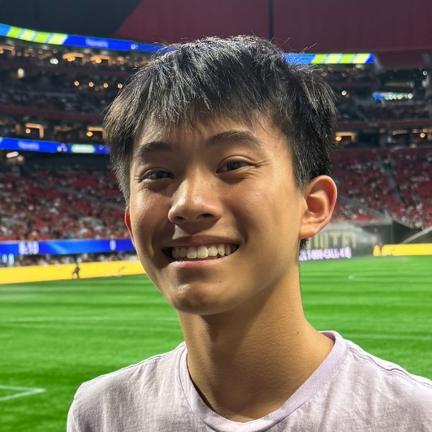

Hey! I'm Alex Wa, a 2nd year Math and CS major at Yale and a YES Scholar. My research interests span RL, NLP, and interpretability, but I've also done research in algebraic topology, abstract algebra, and in the BME space.

In my free time, I enjoy [drawing](https://www.instagram.com/alex_wa_art/) and exploring other ML and math disciplines.

## Posts


  

    <h3><a href="{{ post.url }}">{{ post.title }}</a></h3>
    
{{ post.date | date: "%B %d, %Y" }}

    
      
{{ post.summary }}

    
  

